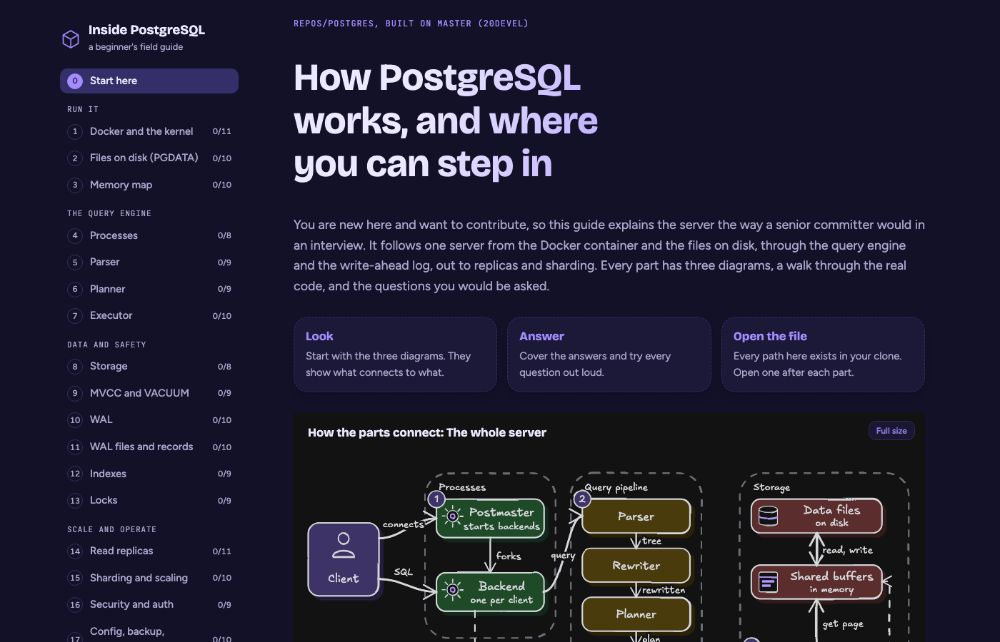
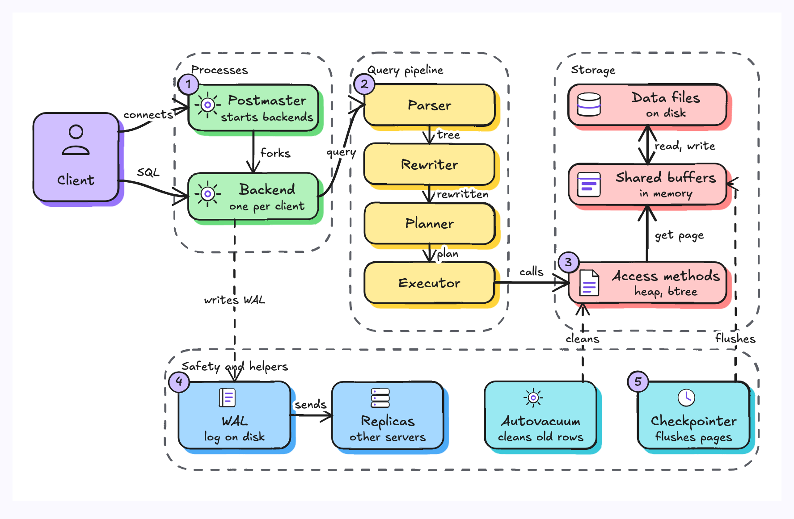
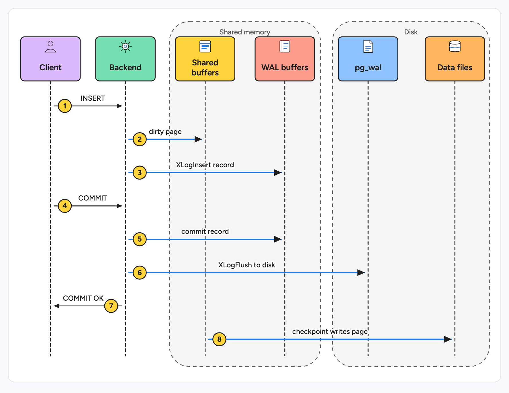
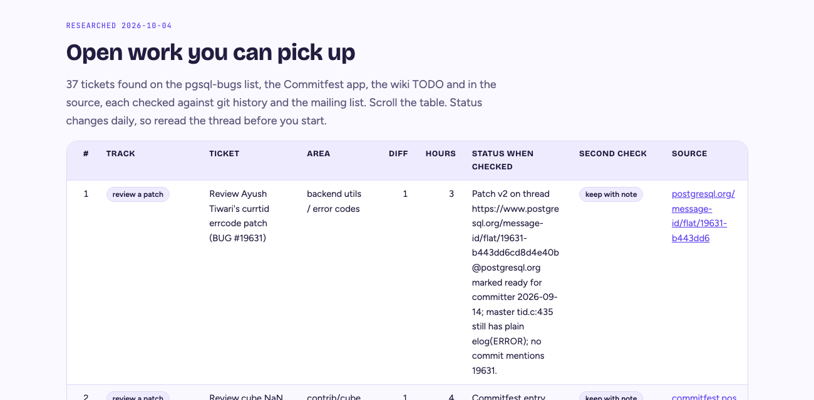

# explorer

Turn any codebase or system into an interactive beginner field guide: SVG diagrams in the form that fits each idea (90 diagram types, hand-drawn or clean, with real logos), a walk through the real files, tables that scroll inside the page, and interview questions you can tick off. Built as a Claude Code skill.



## What you get

- Three SVG diagrams per topic: how it connects, a numbered lifecycle, and the anatomy, each drawn as the type that fits (a layer diagram for tiers, a sequence diagram for calls, an ERD for tables...).
- Two diagram styles from the same SVG, switchable on the page: **hand-drawn** line art and **clean** FigJam-like canvas.
- Real product logos in diagrams through [logo.dev](https://logo.dev), with a monogram fallback when there is no key.
- A [catalog of 90 diagram types](diagram-types/README.md), each with an example SVG, both renders and a guide.
- A step-by-step walk through the real code with file and function names.
- Tables sized by content, scrolling inside the page, with a sticky header.
- 8 to 10 interview questions per topic with simple answers and a common trap.
- Light and dark themes, wide margins, phone friendly, no dependencies.

| Architecture | Lifecycle |
|---|---|
|  |  |



## Diagram types


[`diagram-types/`](diagram-types/README.md) has one folder per type (org charts to sequence diagrams, ERDs, journey maps, Gantt charts, tech stack mapping), each with `example.svg`, `hand.jpg`, `clean.jpg` and a README covering when to use it and its anatomy. The skill reads [`references/diagram-types.md`](skills/codebase-explorer/references/diagram-types.md) to pick the right form for each diagram.

## Logos

Diagrams that name real products use logo slots (`<image class="d-logo" data-logo="postgresql.org">`). To fill them, get a free publishable key at [logo.dev](https://logo.dev) and keep it outside the repo:

```bash
mkdir -p ~/.config/explorer && printf 'LOGO_DEV_TOKEN=%s\n' 'pk_...' > ~/.config/explorer/logo-dev.env
```

Logos are fetched once, cached in `~/.cache/explorer-logos`, and inlined as data URIs, so pages work offline. Without a key each slot becomes a monogram, and so does a project under a foundation domain such as `kafka.apache.org`, because Logo.dev answers those with the foundation's logo. The build warns when two domains return the same image. When the skill needs logos and no key is set, it asks you for one. Logos by [Logo.dev](https://logo.dev); they belong to their owners (see License).

## Install the skill

```bash
git clone https://github.com/yashs33244/explorer.git
cd explorer
./install.sh          # symlinks skills/codebase-explorer into ~/.claude/skills
```

Then ask Claude Code something like: "Use the codebase-explorer skill to build a field guide for this repo."

## Try the example

```bash
node skills/codebase-explorer/scripts/build-page.js \
  --config examples/postgres/explorer.config.json \
  --topics examples/postgres/topics \
  --diagrams examples/postgres/diagrams \
  --out examples/postgres/page.html
open examples/postgres/page.html
```

`examples/postgres` is a real guide: 20 topics, 63 diagrams, 190 questions and a 37-row contribution backlog table.

## Layout

```
skills/codebase-explorer/
  SKILL.md                 the skill (pipeline, quality bar, gotchas)
  scripts/build-page.js    JSON + SVG -> one HTML page (no dependencies)
  scripts/render.sh        look at diagrams (hand or clean, png or jpg) and sections in headless Chrome; --catalog re-renders the gallery
  scripts/compare.sh       a reference image and our render side by side, to check a diagram against the look it copies
  scripts/logos.js         fill logo slots from logo.dev, monogram fallback
  scripts/build-catalog.js regenerate the diagram-type gallery and chooser
  scripts/layout.js        automatic diagram fallback
  assets/                  style.css (page and diagram kit), app.js, icons.md, fonts/ (Excalifont license)
  references/              topic schema, diagram guide, diagram kit, diagram-type chooser, Workflow template
diagram-types/             90 diagram types: example SVG, hand.jpg, clean.jpg, README
examples/postgres/         a complete guide to learn from
docs/how-it-works.md       how the diagrams and facts were produced
```

## Requirements

Node 18+, Google Chrome for previews (`CHROME=/path/to/chrome` to override). `.jpg` renders also need `sips` (built into macOS) or ImageMagick (`magick`); `.png` renders need neither. `compare.sh` needs `uv`. Publishing and the multi-agent workflow use Claude Code's Artifact and Workflow tools.

## Honesty note

The example's facts were read from the PostgreSQL source and checked by a second pass, and many commands were run against Homebrew PostgreSQL 16. The guide says so, and says which commands were not run. Function names move between releases, so confirm against the version you build.

## License

The code and docs are MIT licensed. Two things inside the repo are not:

- The hand-drawn style inlines a Latin subset of Excalifont, Copyright (c) 2024 by Excalidraw, under the SIL Open Font License 1.1. Every built page carries it, so keep [`assets/fonts/Excalifont-OFL.txt`](skills/codebase-explorer/assets/fonts/Excalifont-OFL.txt) with any copy.
- Product logos in the diagrams and in the committed `diagram-types` renders are provided by [Logo.dev](https://logo.dev). They are trademarks of their owners, used only to name the products a diagram shows, and are not covered by the MIT license.
