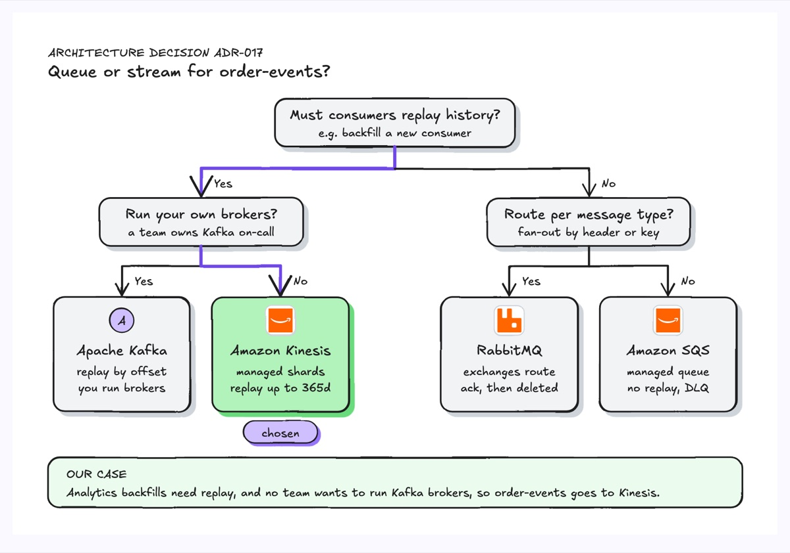
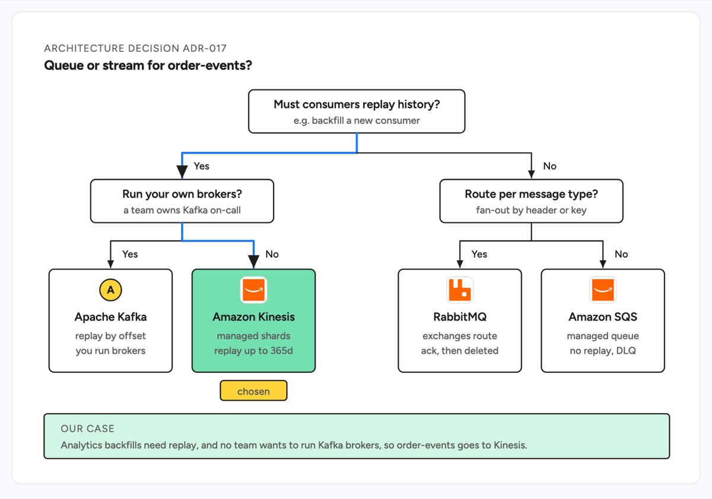

# Decision tree

A decision tree starts from one question at the top and splits on each answer until every path ends in a choice. The example is ADR-017, picking a queue or a stream for an order-events topic: replay history splits streams from queues, then running your own brokers splits Kafka from Kinesis and per-message routing splits RabbitMQ from SQS. The path the team took is highlighted and the leaf it reached is marked as chosen, with the reason in a band underneath.

| Hand-drawn | Clean |
|---|---|
|  |  |

## Use it to explain

- How an ADR reached its choice between databases, queues, caches or hosting options.
- The triage rules an on-call engineer follows to route an alert or a bug.
- Which code path a feature flag, config or request header sends a request down.

Not for: a process with loops or hand-offs between teams; use a flowchart or a cross-functional flowchart.

## Anatomy

| Part | Class | Rule |
|---|---|---|
| Question | `d-box` + `d-t` + `d-s` | a yes or no question, with an example of what it means |
| Split | `d-edge` bracket with marker | orthogonal: down, across, down into each child |
| Answer | `d-lab` | Yes or No beside each drop, never on the arrowhead |
| Chosen path | `d-edge acc thick` | the route taken for this case only |
| Leaf | `d-box` + `d-logo` + `d-t` + two `d-s` | the option and the two facts that decided it |
| Chosen leaf | `d-box g1` + `d-tag acc` | the one leaf picked |
| Our case | `d-band g1` + `d-k` + `d-s` | one sentence tying the path to the real situation |

## Tips

- Order the questions so the first one removes the most options.
- Give every leaf the same two facts so they compare side by side.
- Highlight one path for a real case; a tree with no path chosen reads as a catalog.

Reference: Figma template Decision tree

Source: [example.svg](example.svg)
