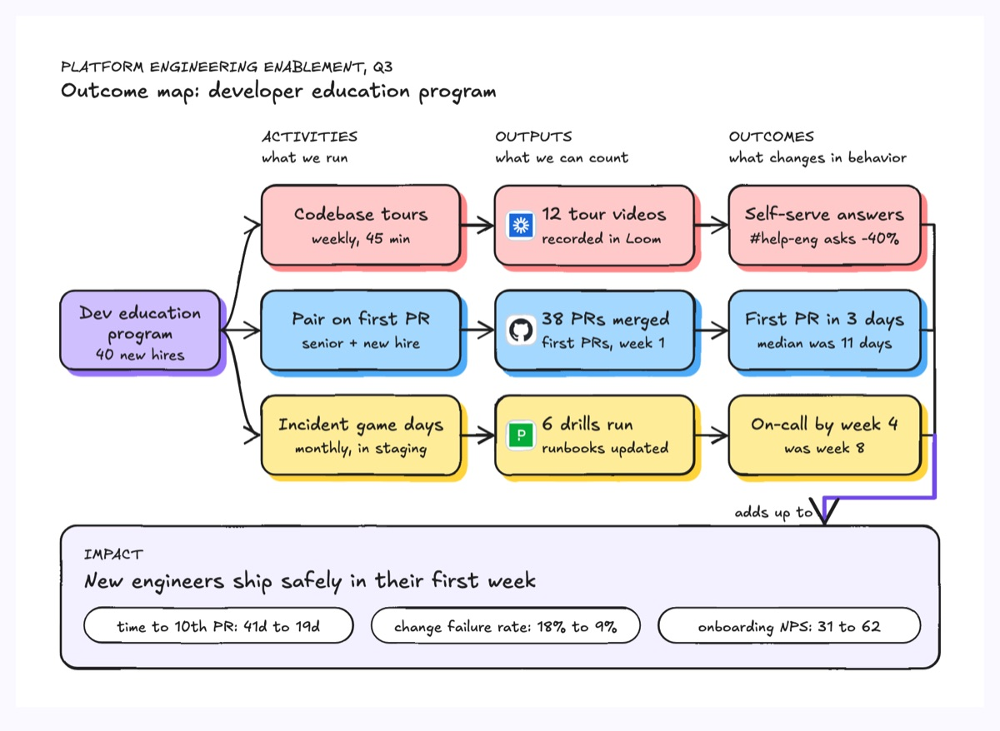
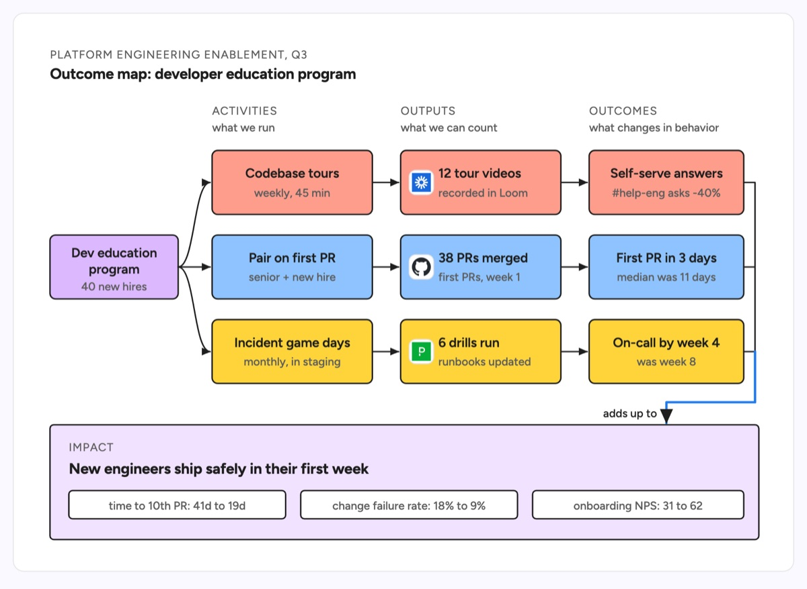

# Outcome mapping

An outcome map runs from one program on the left through rows of activities, outputs and outcomes, and ends in the impact they add up to. The example is a platform engineering developer education program for 40 new hires: codebase tours, pairing on a first PR and incident game days each produce something countable (tour videos in Loom, merged PRs, drills) and change a behavior (fewer help-channel asks, first PR in 3 days, on-call by week 4). The impact band holds the headline and the metrics that prove it.

| Hand-drawn | Clean |
|---|---|
|  |  |

## Use it to explain

- How a platform or DevEx investment turns into delivery metrics like lead time and change failure rate.
- Why an internal tool, docs push or reliability program is worth funding, from work done to result.
- The difference between what a team shipped (outputs) and what changed for its users (outcomes).

Not for: a dependency graph between tasks or a schedule; use a Gantt chart or a roadmap.

## Anatomy

| Part | Class | Rule |
|---|---|---|
| Program | `d-box g0` | the initiative and its scope, left of the rows |
| Column header | `d-k` + `d-s` | ACTIVITIES, OUTPUTS, OUTCOMES, each with what it means |
| Row | `d-box g3` / `g4` / `g2` | one color per thread, same color across the row |
| Output proof | `d-logo` | where the countable output lives (video tool, repo, paging tool) |
| Link | `d-edge` with marker | left to right only; curves fan out from the program |
| Group | `d-edge` bracket + `d-edge acc thick` | joins every outcome row, then one arrow carries them down to impact |
| Impact | `d-band g0` + `d-h` + `d-tag` | one headline, then before-to-after metrics |

## Tips

- An output is a count you control; an outcome is a change in someone else's behavior. Keep them in separate columns.
- Write every outcome and metric as before and after, so it can be checked.
- Three rows is enough; more threads belong on a second map.

Reference: Figma template Outcome mapping

Source: [example.svg](example.svg)
