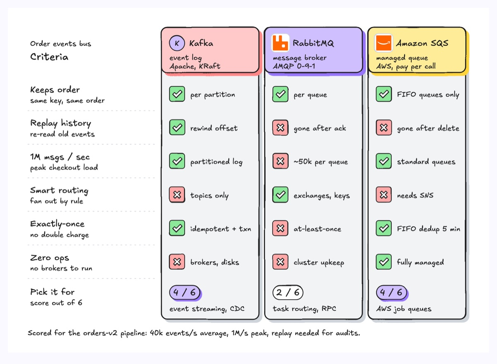
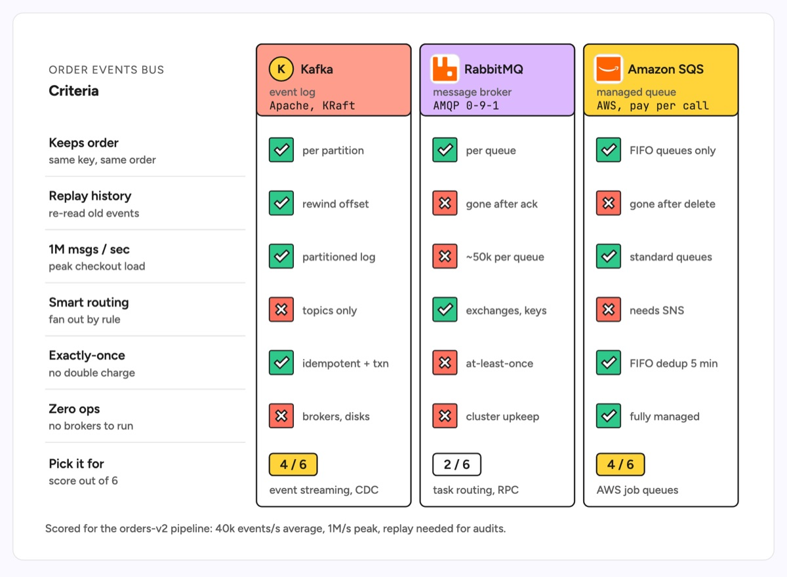

# Product comparison

Side-by-side columns, one per product, each with a coloured header and a stack of check or cross marks against the same criteria. The criteria sit in a left column so every row reads across, and a score plus a one-line verdict closes each column. The example picks a message bus for an orders pipeline: Kafka, RabbitMQ and Amazon SQS scored on ordering, replay, throughput, routing, exactly-once delivery and operational load.

| Hand-drawn | Clean |
|---|---|
|  |  |

## Use it to explain

- Why a design doc picked one queue, database or framework over its alternatives.
- Which managed service covers the requirements a migration must keep.
- How build-vs-buy options stack up on the criteria the team agreed on.

Not for: numbers along a continuous scale (use a bar chart) or two-way trade-offs between only two factors (use `quad-chart`).

## Anatomy

| Part | Class | Rule |
|---|---|---|
| Product column | `d-box` | One tall card per product, equal width, same height |
| Column header | `d-box g0`..`g5` + `d-logo` | Distinct colour per product, logo slot, name in `d-t`, kind in `d-s`, flavour in `d-m` |
| Criteria column | `d-k`, `d-h`, `d-t`, `d-s` | Criterion name plus what it means for this system |
| Row divider | `d-grid` | Thin rule under each criterion, left column only |
| Pass mark | `d-fill g1` + `d-fillpaper` tick | Green square with a white tick, then a 1 to 3 word reason in `d-s` |
| Fail mark | `d-fill g3` + `d-fillpaper` cross | Red square with a white cross, then the reason |
| Score and verdict | `d-tag` / `d-tag acc` + `d-s` | Score pill (accent for the winners), then "pick it for" |

## Tips

- Phrase every criterion so that a tick is always good; mixing "has X" and "avoids Y" makes columns unreadable.
- Always write the reason next to the mark; a bare tick invites the argument the diagram should settle.
- Keep it to three or four products and five to seven criteria.
- Name the workload in the caption, since the scores only hold for that workload.

Reference: Figma template Product comparison

Source: [example.svg](example.svg)
