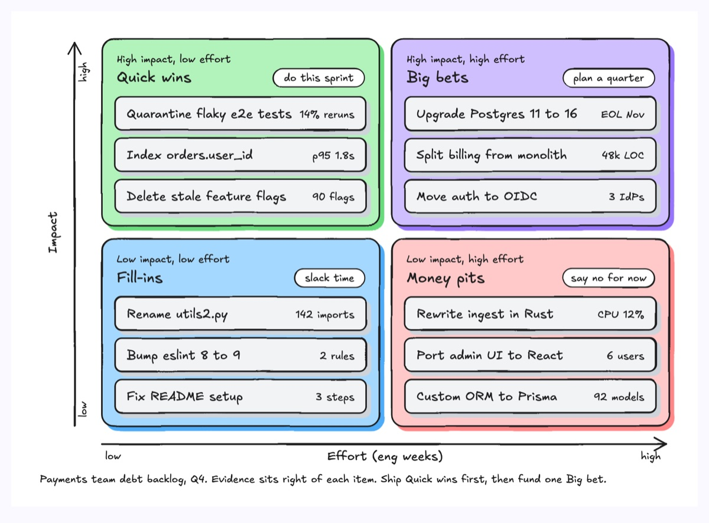
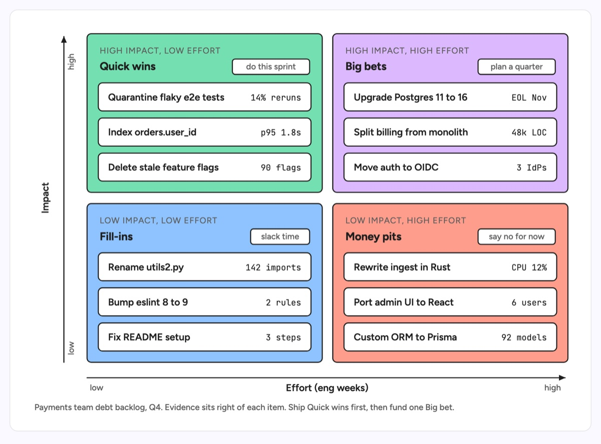

# Quad chart

Four equal panels in a two by two grid, split by two axes, so every item lands in exactly one quadrant. Each panel gets a kicker naming its axis values, a title, an action tag and a short list of items. The example sorts a payments team's tech debt backlog by impact and effort into Quick wins, Big bets, Fill-ins and Money pits, with the evidence behind each item.

| Hand-drawn | Clean |
|---|---|
|  |  |

## Use it to explain

- Which tech debt items to fund this quarter and which to decline.
- How incidents or alerts split by severity and frequency.
- Where services sit on risk versus ownership when planning a migration.

Not for: more than two deciding factors (use `product-comparison`) or exact positions on a scale (use a scatter plot).

## Anatomy

| Part | Class | Rule |
|---|---|---|
| Quadrant | `d-box g1`, `g0`, `g4`, `g3` | Four equal panels, best quadrant top left in green, worst bottom right in red |
| Quadrant header | `d-k`, `d-h` | Kicker states the axis values, title names the quadrant |
| Action tag | `d-tag` + `d-s` | What to do with items in that quadrant |
| Item | `d-box` + `d-t` + `d-m` | One card per item, the evidence right-aligned in mono |
| Axes | `d-axis` + marker | Impact up the left, effort along the bottom, with low and high ends |

## Tips

- Put the evidence on every card (rerun rate, latency, line count); without it the placement is just an opinion.
- Keep three items per quadrant so the panels stay the same size.
- Say what to do with each quadrant in its tag, not only what it is.

Reference: Figma template Quad chart

Source: [example.svg](example.svg)
