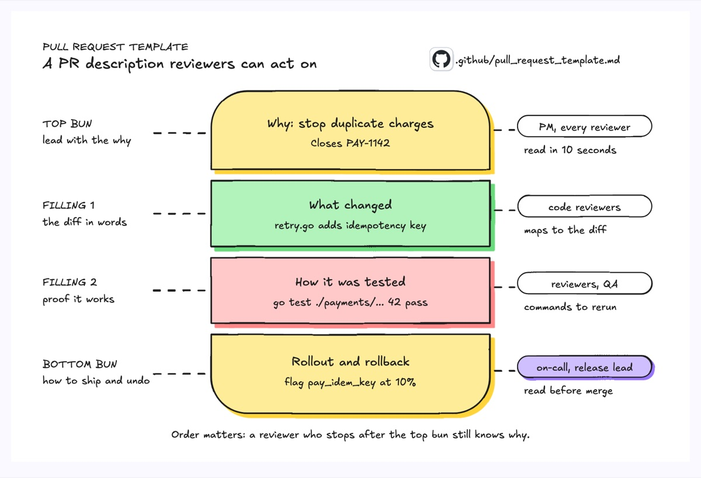
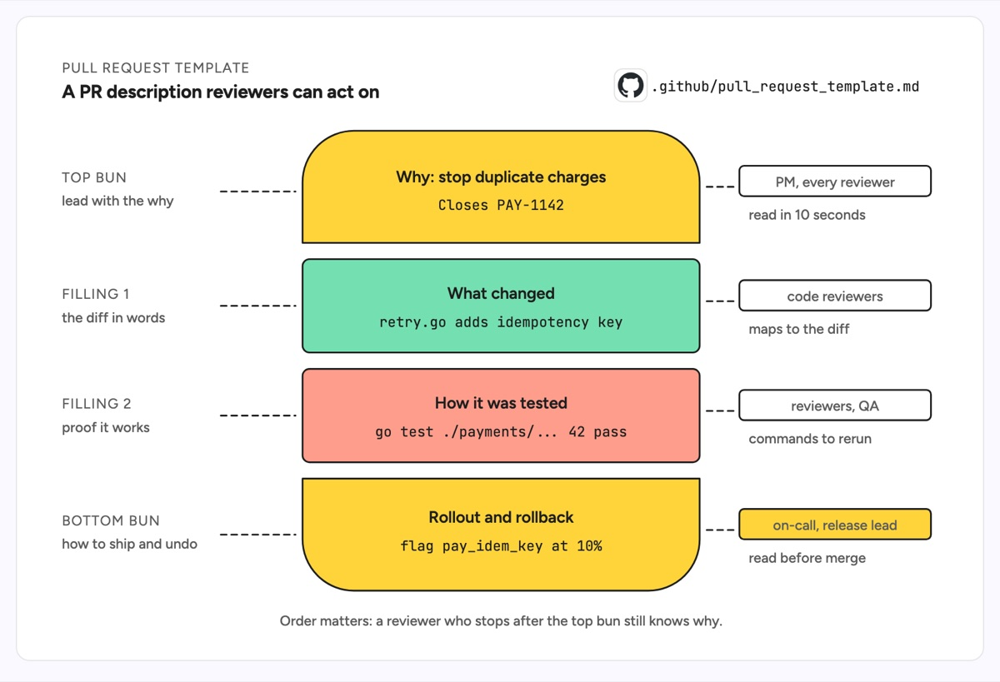

# Sandwich chart

A sandwich chart stacks content as layers between two buns: the top bun opens, the fillings carry the substance, and the bottom bun closes. The example is the structure of a pull request description for a payments fix: the top bun states why the change exists and links the ticket, the fillings say what changed and how it was tested, and the bottom bun says how it rolls out behind a flag and how to undo it. The left column gives the rule for each layer and the right column says who reads it.

| Hand-drawn | Clean |
|---|---|
|  |  |

## Use it to explain

- The sections of a PR, RFC or incident report template and the order they go in.
- Which part of a release note or changelog entry each audience (PM, reviewer, on-call) actually reads.
- How a commit message or ADR wraps the technical detail between a summary and a consequence.

Not for: steps that happen in time order or branch; use a flowchart or a timeline.

## Anatomy

| Part | Class | Rule |
|---|---|---|
| Top bun | `d-box g2` on a path, rounded top only | the opener: the why, in one line plus a ticket id |
| Filling | `d-box g1`, `d-box g3` rects | the substance, one layer per section, same width as the buns |
| Bottom bun | `d-box g2` on a path, rounded bottom only | the close: rollout, risk, how to undo |
| Layer text | `d-t` + `d-m` | a title and one real example (file, command, flag) |
| Layer rule | `d-k` + `d-s`, dashed `d-edge dash` | what the layer is for, on the left |
| Reader | `d-tag` (`acc` for the one that matters most) + `d-s` | who reads that layer, on the right |
| Source | `d-logo` + `d-m` | where the template lives |

## Tips

- Keep both buns the same color so the two ends read as one frame.
- Put a concrete example in every layer, not a placeholder like "description here".
- Two or three fillings is the limit; more and it stops reading as a sandwich.

Reference: Figma template Sandwich chart

Source: [example.svg](example.svg)
