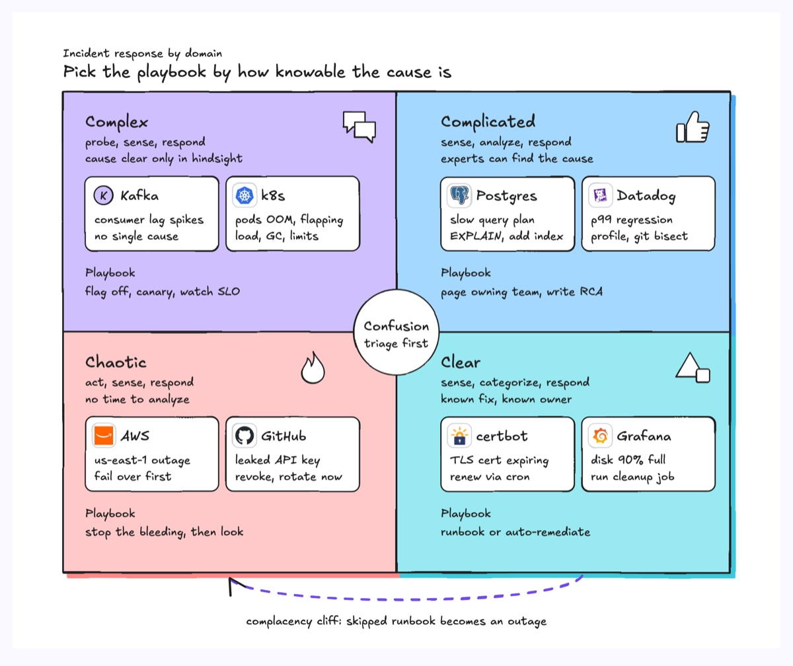
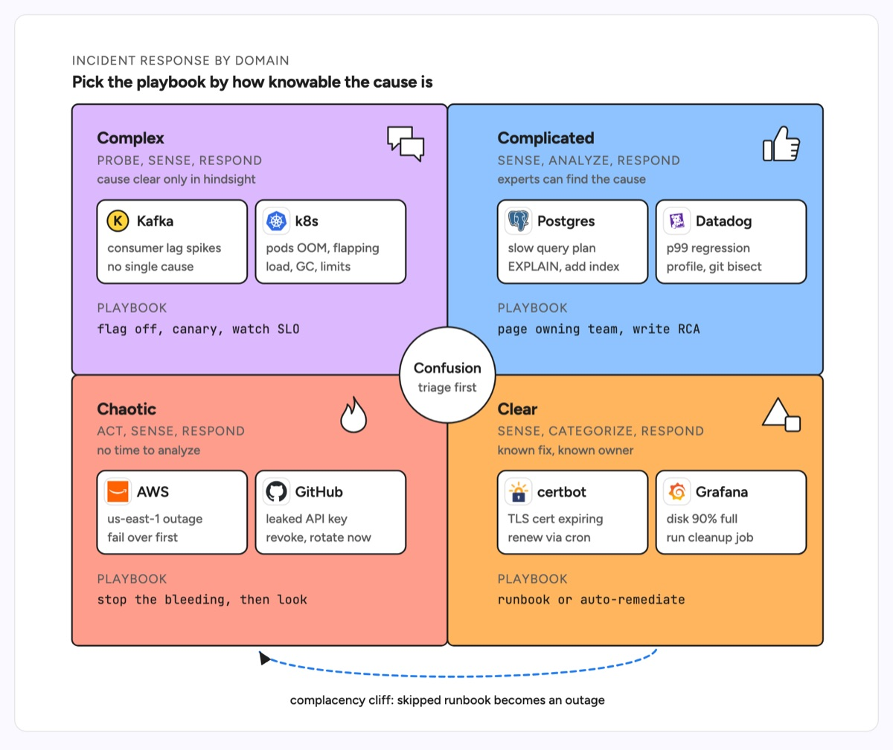

# Cynefin framework

Four domains in a two-by-two grid, sorted by how knowable cause and effect are: Complex (cause only clear in hindsight), Complicated (experts can find it), Chaotic (no time to look) and Clear (known fix), with Confusion in the middle for situations not yet sorted. Each domain has its own way to respond. The example sorts production incidents: Kafka lag spikes and flapping pods are complex, a Postgres plan regression and a p99 regression are complicated, a region outage and a leaked API key are chaotic, an expiring TLS cert and a full disk are clear, and a dashed arrow marks the complacency cliff from clear to chaotic.

| Hand-drawn | Clean |
|---|---|
|  |  |

## Use it to explain

- Why an incident process has different playbooks: probe with flags and canaries, analyse with experts, act first, or follow the runbook.
- How to route alerts: which ones should page the owning team for an RCA and which should auto-remediate.
- Why a team that skips its runbooks for "clear" work ends up in a chaotic outage.

Not for: ranking incidents by severity or impact (use `heat-map`).

## Anatomy

| Part | Class | Rule |
|---|---|---|
| Domain cell | `d-box g0`, `g4`, `g3`, `g5` | Complex top-left, Complicated top-right, Chaotic bottom-left, Clear bottom-right |
| Domain icon | `d-fillpaper`, `d-line` | Top-right of each cell, as in the template (bubbles, thumbs up, flame, shapes) |
| Domain header | `d-h`, `d-k`, `d-s` | Name, the response pattern (probe, sense, respond) and what makes it this domain |
| Example card | `d-fillpaper` + `d-logo` + `d-t`, `d-s` | Two real incidents per domain: the system, the symptom, the first move |
| Playbook | `d-k` + `d-m` | The team's default action for the domain |
| Confusion | `d-fillpaper` circle | Centre of the grid, overlapping all four cells |
| Complacency cliff | `d-edge dash acc` + `d-lab` | Under the grid, from Clear to Chaotic |

## Tips

- Keep content clear of the centre circle: pad the right-hand cells further from the middle line.
- Two examples per domain is enough; the point is the contrast between domains, not a full incident log.
- Name the first move in each card so a reader sees the response, not only the category.

Reference: Figma template Cynefin framework

Source: [example.svg](example.svg)
