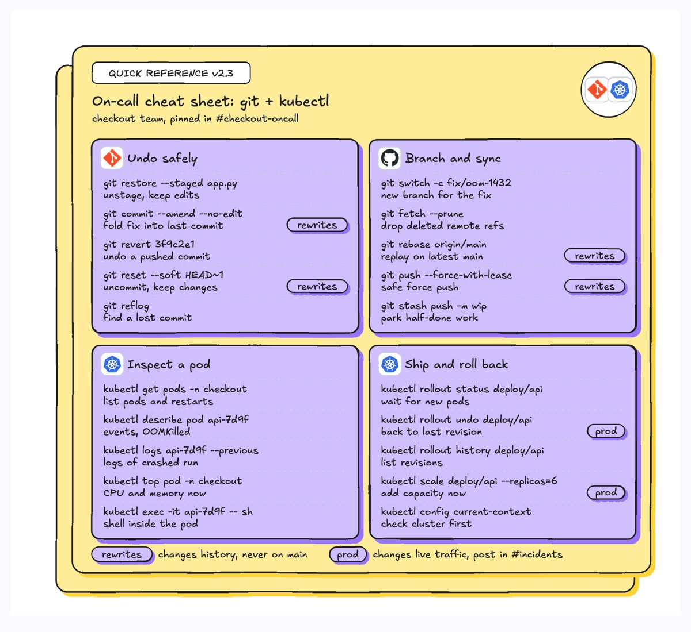
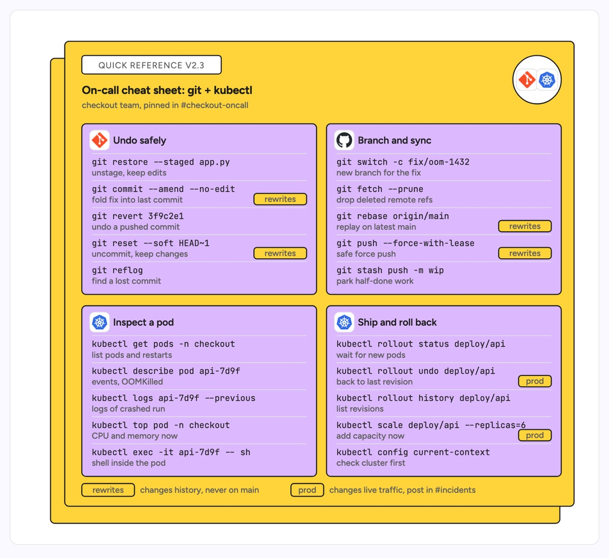

# Quick reference guide

A single card that holds the handful of commands or facts a reader needs under pressure, split into a 2x2 grid of panels by task. A stacked card behind it says "there is more, this is the front page". The example is the checkout team's on-call cheat sheet: git commands for undoing work and syncing branches, kubectl commands for inspecting pods and rolling back a deploy, with the commands that rewrite history or change production flagged.

| Hand-drawn | Clean |
|---|---|
|  |  |

## Use it to explain

- The commands an on-call engineer runs during an incident, grouped by what they are trying to do.
- Which operations in a CLI are safe and which rewrite history or touch production.
- The day-one workflow of a repo (build, test, release) for a new joiner.

Not for: the order in which steps must happen (use `flowchart` or `vertical-timeline`).

## Anatomy

| Part | Class | Rule |
|---|---|---|
| Card stack | `d-box g2` x2 | Back card offset down-left, front card holds everything |
| Header | `d-tag` + `d-k`, `d-h`, `d-s` | Version kicker, card title, owner or where it is pinned |
| Tool badge | `circle d-fillpaper` + `d-logo` | Top-right circle with the logos the card covers |
| Panel | `d-box g0` + `d-logo` + `d-t` | One task per panel, 2x2 grid, equal sizes |
| Command row | `d-m` + `d-s` + `d-grid` | Command on top, plain-English effect under it, rule between rows |
| Danger flag | `d-tag acc` | Short pill on rows that rewrite history or change prod, explained in the legend |

## Tips

- Name panels by intent ("Undo safely"), not by tool, so readers find the row from their goal.
- Keep five rows per panel; a sixth means a second card.
- Use real example arguments (a branch name, a pod name) so the command can be copied and adapted.

Reference: Figma template Quick reference guide

Source: [example.svg](example.svg)
