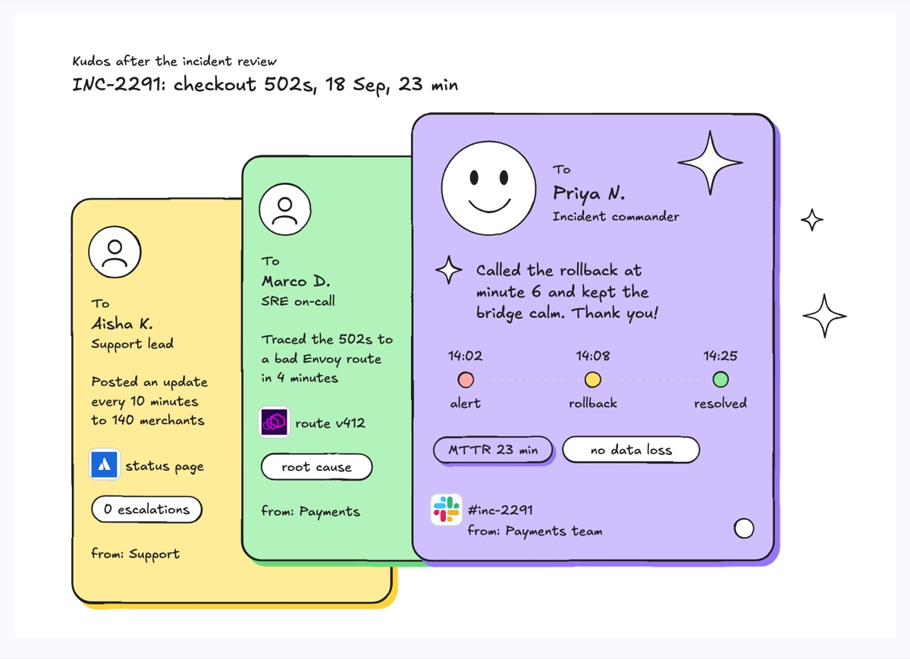
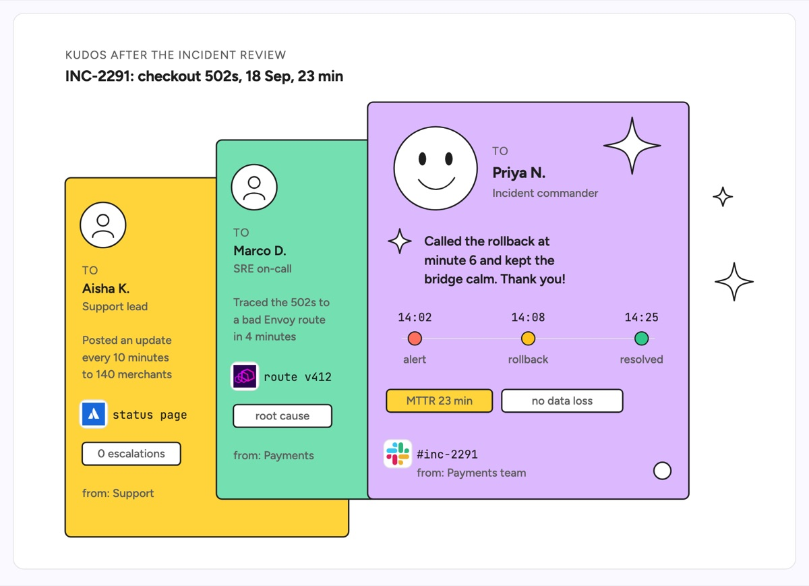

# Kudos cards

A fanned stack of thank-you cards, one per person, with the front card fully open and the cards behind it showing their recipient, role and the one thing they did. The example thanks three people after incident INC-2291, a 23 minute checkout outage of 502s: the support lead who kept 140 merchants updated on the status page, the on-call SRE who traced it to a bad Envoy route, and the incident commander who called the rollback at minute 6.

| Hand-drawn | Clean |
|---|---|
|  |  |

## Use it to explain

- Who did what during an incident response, as the warm close to a blameless postmortem.
- The cross-team effort behind a launch or migration, one card per contributor.
- The concrete behaviours a team wants to see more of (fast rollback, clear status updates).

Not for: the incident timeline or root cause analysis itself (use `vertical-timeline` or `causal-loop`).

## Anatomy

| Part | Class | Rule |
|---|---|---|
| Header | `d-k`, `d-h` | The event being celebrated: incident id, what broke, date, duration |
| Card | `d-box g2`, `g1`, `g0` | One per person, offset so each one's strip stays readable |
| Avatar | `d-fillpaper` circle + `d-line` person or smiley | Top of each card |
| Recipient | `d-k` "To", `d-t`/`d-h` name, `d-s` role | Name first, role under it |
| Message | `d-s` (back cards), `d-t` (front card) | One specific action, not "great job" |
| Evidence | `d-logo` + `d-m`, `d-tag` | The tool or artifact involved and one outcome |
| Front timeline | `d-grid` + `d-fill` dots + `d-m` times | Optional, shows when the key moment happened |
| Sparkles | `d-fillpaper` four-point stars | Decoration, kept outside the text |

## Tips

- Name the exact action and minute; specificity is what makes a kudos land.
- Keep back-card text within the visible strip, about 20 characters a line.
- Put the person whose call changed the outcome on the front card.

Reference: Figma template Kudos cards

Source: [example.svg](example.svg)
