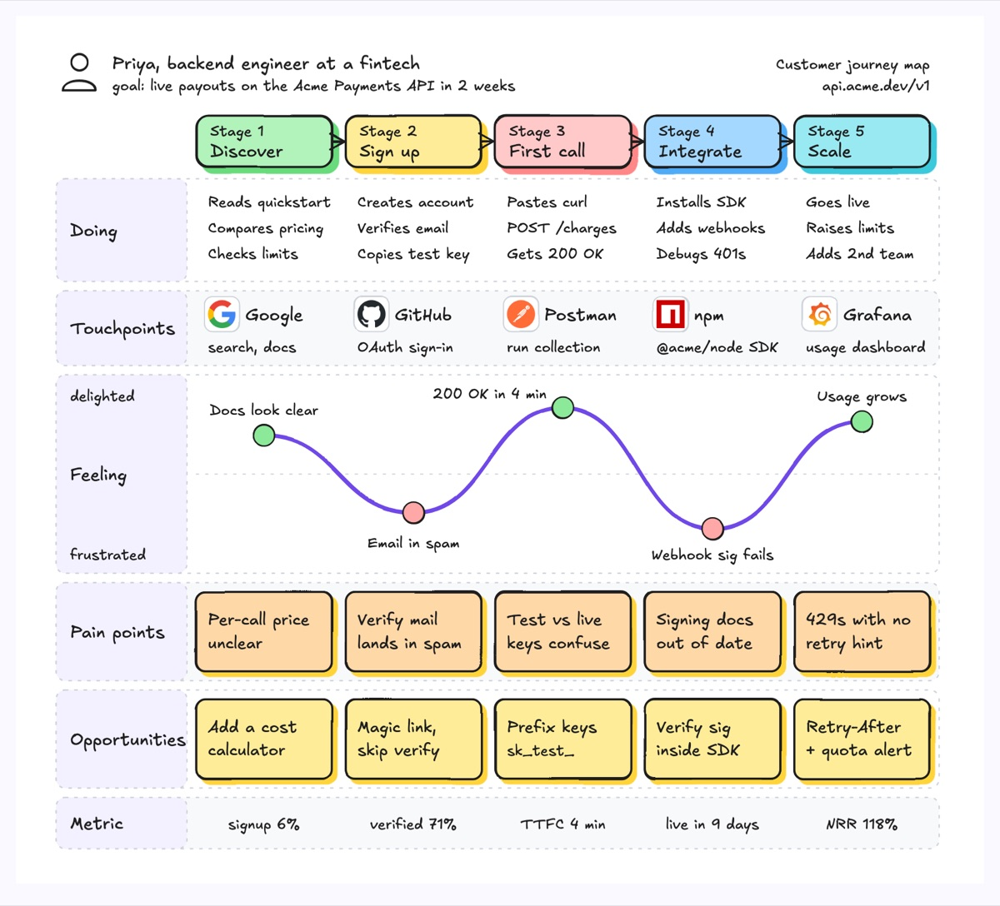
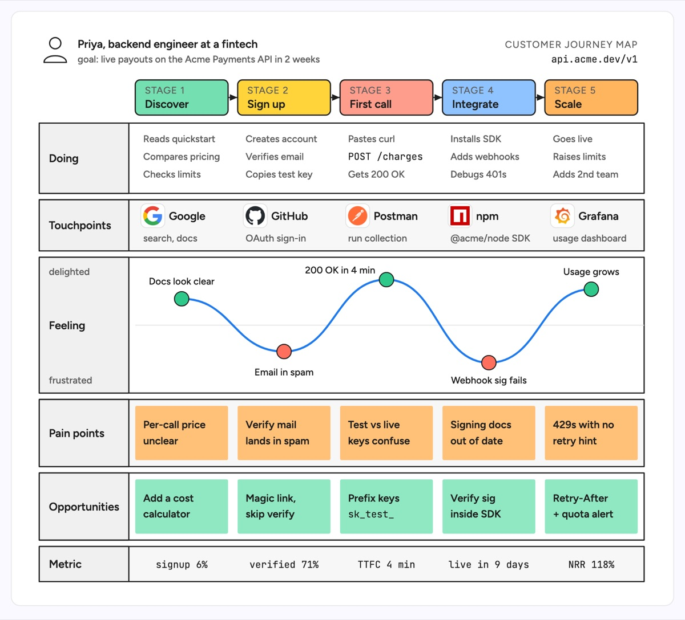

# Customer journey map

A grid with the customer's stages as columns and what happens in each as rows: what they do, where they touch the product, how they feel (an emotion curve), what hurts, and what to change, closed by one metric per stage. The example follows Priya, a backend engineer, adopting the Acme Payments API: discover, sign up, first call, integrate and scale, with dips at email verification and webhook signing and a peak at a 200 OK in four minutes.

| Hand-drawn | Clean |
|---|---|
|  |  |

## Use it to explain

- Developer experience of an API or SDK from first search to production traffic, and where time-to-first-call is lost.
- Which docs, auth or error-handling changes would remove the biggest drop in the funnel.
- How product metrics per stage (signup rate, TTFC, NRR) line up with what the developer felt.

Not for: the internal systems that serve each step (use `service-blueprint` or `sequence-diagram`).

## Anatomy

| Part | Class | Rule |
|---|---|---|
| Persona | person icon, `d-t`, `d-s` | One named persona and their goal, top left |
| Stage header | `d-box g1`..`g5` + `d-k`, `d-t` | One coloured box per stage, joined by short `d-edge` arrows |
| Row | `d-lane` / `d-lane alt` + `d-lanehead` | Doing, Touchpoints, Feeling, Pain points, Opportunities, Metric |
| Touchpoint | `d-logo` + `d-t`, `d-s` | Real product logo, name, what it is used for |
| Emotion curve | `d-grid` baseline, `d-edge acc thick`, `d-fill g1`/`g3` dots | One dot per stage, above the line is good, below is bad; `d-lab` says why |
| Pain and fix | `d-note g4`, `d-note g2` | One sticky per stage per row, fix sits under its pain |
| Metric | `d-m` | One number per stage, centred |

## Tips

- Label each dip with the concrete cause ("Webhook sig fails"), not a mood word.
- Every pain note should have a matching opportunity note directly below it.
- Keep five stages or fewer; split a longer journey into two maps.

Reference: Figma template Customer journey map

Source: [example.svg](example.svg)
