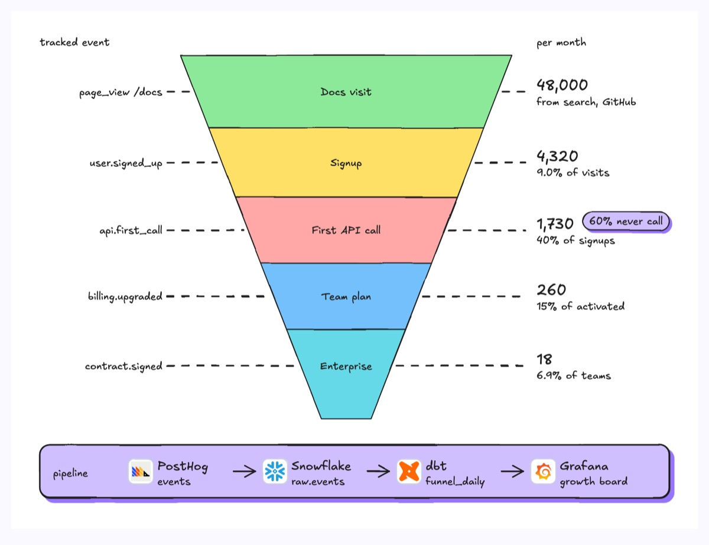
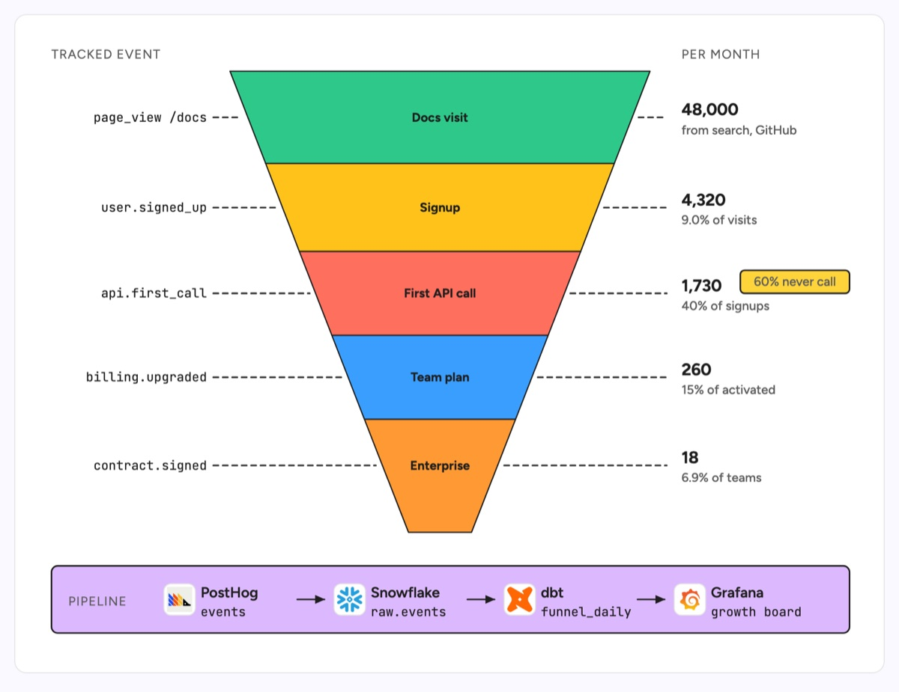

# Marketing funnel

An inverted funnel of stacked bands, widest at the top, each band one stage a prospect passes through. Dashed leaders tie each band to the analytics event that marks it on the left and to its monthly count and stage conversion on the right, and a pipeline strip at the bottom shows where the numbers come from. The example is a developer tool: docs visits, signups, first API call, team plan and enterprise contract, tracked in PostHog, modelled in Snowflake with dbt and charted in Grafana, with the signup to first call drop (60% of signups never call the API) flagged as the leak to fix first.

| Hand-drawn | Clean |
|---|---|
|  |  |

## Use it to explain

- Which product events define each funnel stage, so growth and engineering count the same thing.
- Where activation leaks (signup to first API call) and which onboarding work to prioritise.
- How funnel numbers flow from event tracking to the warehouse and the dashboard.

Not for: a journey with branches or loops (use `flowchart` or a customer journey map).

## Anatomy

| Part | Class | Rule |
|---|---|---|
| Stage band | `d-fill g1`..`g5` + `d-tw` | Trapezoid, one colour per stage, name centred inside |
| Tracked event | `d-m` | Event name on the left, right aligned to its leader |
| Leader | `d-edge dash` | Horizontal, from band edge to the label column |
| Count and rate | `d-h`, `d-s` | Monthly count, then conversion from the stage above |
| Callout | `d-tag acc` | Marks the leak to fix first: the biggest drop among people who already signed up, stated as a number |
| Data pipeline | `d-box g0` + `d-logo`, `d-edge` | Source to dashboard, left to right: tracking, raw warehouse table, dbt model, chart |

## Tips

- Give each band a real event name; a funnel without definitions gets argued about.
- Show conversion from the stage above, not from the top, so each leak reads on its own.
- Keep the bottom band truncated so its label fits; a pointed tip has no room for text.

Reference: Figma template Marketing funnel

Source: [example.svg](example.svg)
