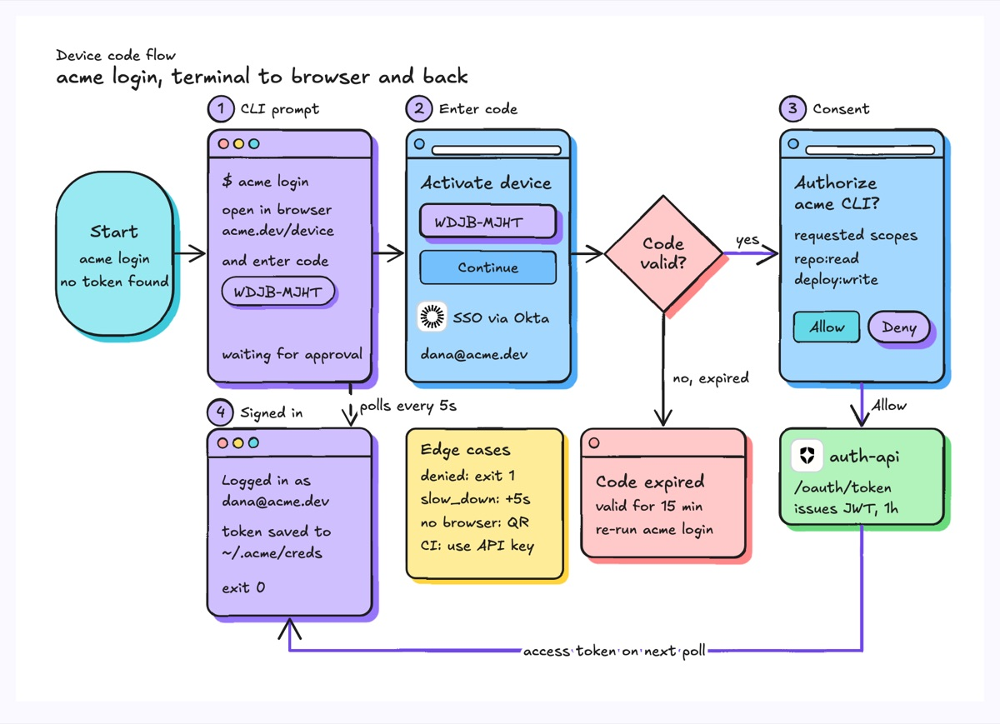
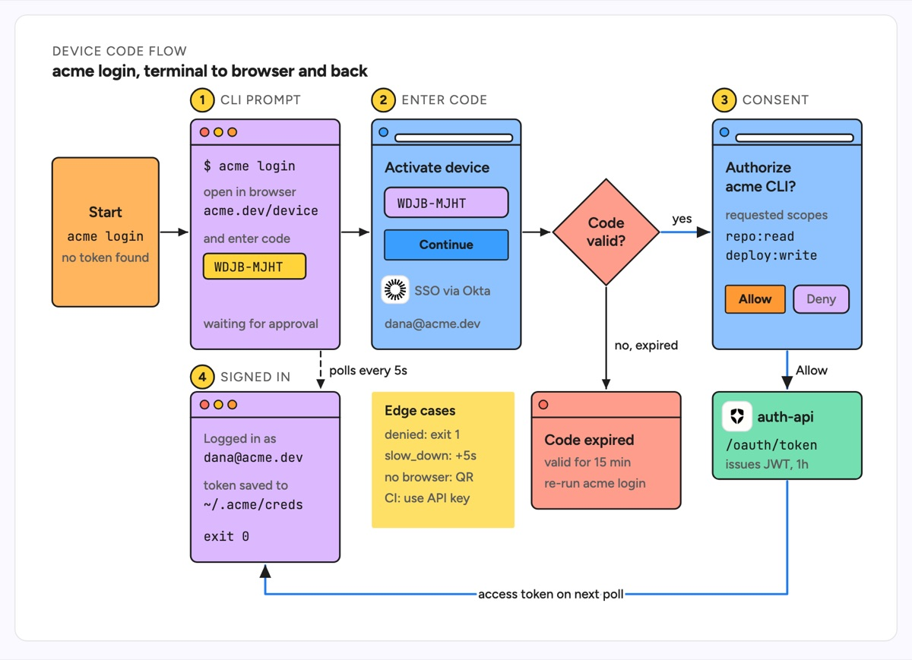

# User experience workflow

A left-to-right run of screens a user moves through, drawn as small screen frames joined by arrows, with a diamond wherever the product makes a decision and a branch for the unhappy path. Each screen is numbered and named so the flow can be discussed step by step. The example is the `acme login` device-code flow: the terminal prints a code, the developer enters it in the browser behind Okta SSO, the code is checked, the consent screen grants `repo:read` and `deploy:write`, auth-api issues a token and the polling terminal shows "Logged in", with an expired-code branch and a note of edge cases.

| Hand-drawn | Clean |
|---|---|
|  |  |

## Use it to explain

- A login or onboarding flow that crosses surfaces (CLI, browser, email) and where the user can drop off.
- What each screen shows and which backend call moves the user to the next one.
- The error and timeout branches a feature must design screens for, not just the happy path.

Not for: the protocol messages between services in time order (use `sequence-diagram`).

## Anatomy

| Part | Class | Rule |
|---|---|---|
| Start | `d-box g5`, large `rx` | One rounded terminator on the left with the trigger command |
| Screen | `d-box g0` (terminal) or `g4` (browser) | Title bar line, then 3 to 6 short lines of real UI copy |
| Screen name | `d-badge` + `d-k` | Numbered badge and caps name above each frame |
| Decision | `path.d-box g3` diamond | Short question, `yes` and `no` labels on its exits |
| Error screen | `d-box g3` | Below the decision, says what failed and how to recover |
| Backend step | `d-box g1` + `d-logo` | The service that unlocks the next screen, with its endpoint in `d-m` |
| Step arrow | `d-edge` / `d-edge acc` | Happy path in accent; dashed for background polling |
| Edge cases | `d-note` | Sticky note for cases not worth a screen |

## Tips

- Use the product's real copy on each screen; "Enter code" beats "Screen 2".
- Keep the happy path on one row and push failures down, so the eye reads success first.
- Draw the background work (polling, webhooks) as dashed arrows so it reads as "while waiting".

Reference: Figma template User experience workflow

Source: [example.svg](example.svg)
