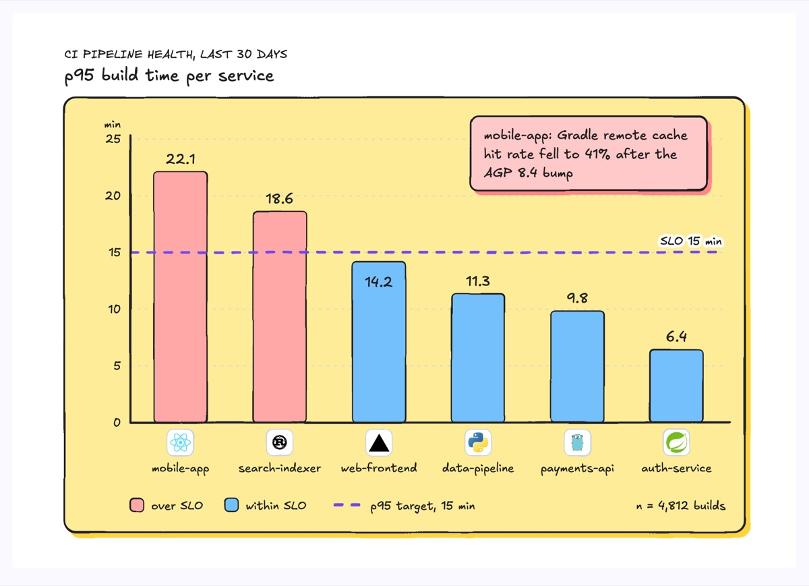
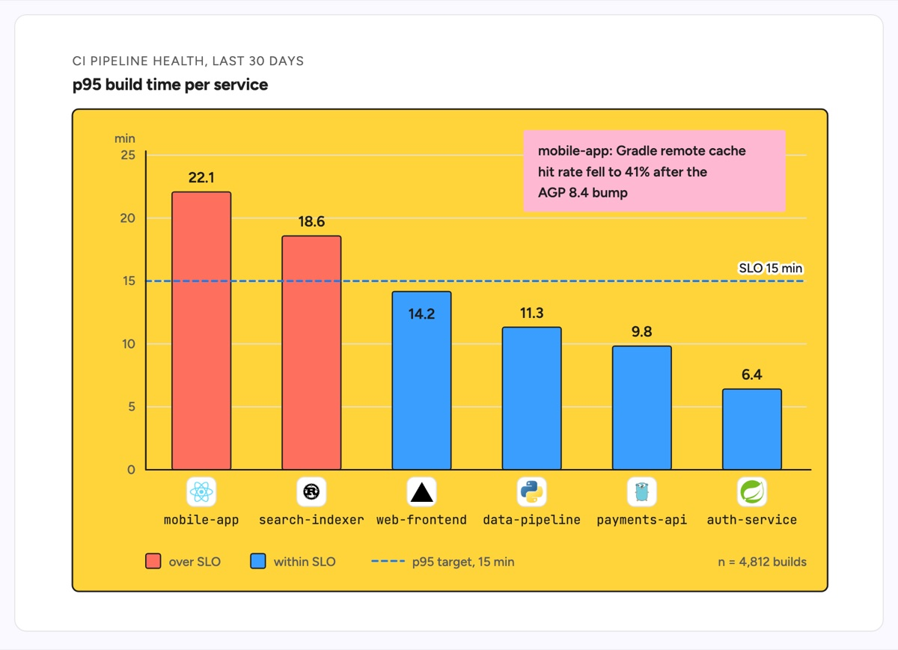

# Bar graph

A bar graph compares one number across a set of categories by bar length, so the biggest and smallest stand out at a glance. This example is a CI health report: p95 build time over the last 30 days for six services, sorted longest first, against a dashed 15 minute SLO line. mobile-app and search-indexer breach the target and are colored differently, each service carries its stack logo, and a sticky note records the cause found for the worst offender (a Gradle remote cache regression).

| Hand-drawn | Clean |
|---|---|
|  |  |

## Use it to explain

- Which services or pipelines are slowest, most expensive or noisiest, compared on one metric.
- How each category sits against a target: an SLO, a budget or an error threshold.
- Where to spend the next fix: the tallest bar with a note on why it is tall.

Not for: a metric changing over time (use a line chart) or parts of one total (use a pie chart or a stacked bar).

## Anatomy

| Part | Class | Rule |
|---|---|---|
| Chart frame | `d-box g2` | One panel holding axes, bars and legend, like the template frame |
| Axes and gridlines | `d-axis`, `d-grid` | Start the value axis at 0; a few round ticks in `d-s`, unit above the axis |
| Bar | `d-fill g0`..`g5` | Equal width and gap; color only carries meaning (here over or within SLO) |
| Value label | `d-t` (or `d-tw` inside a bar) | Exact value at the bar end so nobody reads it off the grid |
| Category label | `d-m` + `d-logo` | Real service name and its stack logo under each bar |
| Target line | `d-edge dash acc` + `d-lab` | Threshold drawn across all bars, named at its end |
| Legend and sample size | `d-fill` swatch + `d-s` | One row under the axis, with n for the data |
| Finding | `d-note` + `d-tn` | The why behind the outlier, placed above the short bars |

## Tips

- Sort bars by value unless the categories have a natural order.
- Keep labels horizontal; if names do not fit, widen the slot or switch to horizontal bars.
- Use two colors at most for status, never one color per bar for decoration.
- Put the threshold on the chart, not only in the caption.

Reference: Figma template Bar graph

Source: [example.svg](example.svg)
