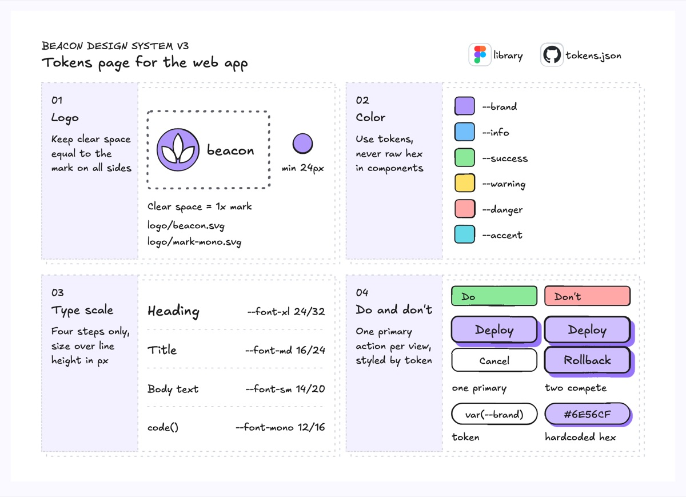
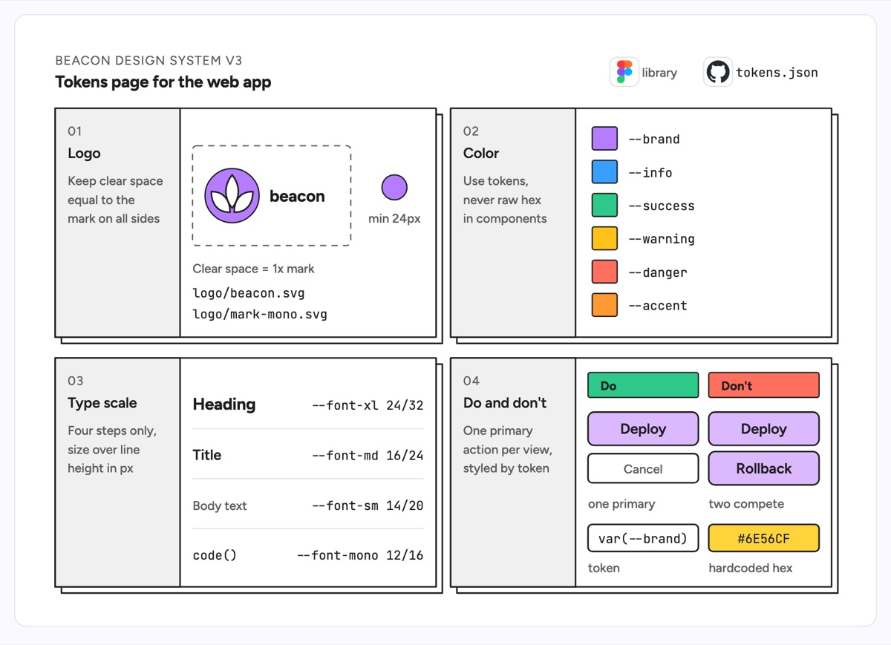

# Brand guidelines

Brand guidelines are a deck of pages, each split into a grey rule panel on the left and a worked example on the right. The example is the tokens page of a product design system, Beacon v3, as four stacked pages: logo clear space and minimum size, color tokens by role, the type scale with token names, and a do and don't page that bans competing primary buttons and raw hex values in component code.

| Hand-drawn | Clean |
|---|---|
|  |  |

## Use it to explain

- Which design tokens a frontend codebase exposes and what each one is for.
- The rules a UI component library enforces, with a right and a wrong example side by side.
- How the Figma library and the `tokens.json` in the repo line up.

Not for: the component tree or how tokens are built; use a directory tree or a flowchart.

## Anatomy

| Part | Class | Rule |
|---|---|---|
| Page | `d-lane` | equal pages in a 2 by 2 grid |
| Stack | `d-lane` offset 6px | one sheet behind each page, so it reads as a deck |
| Rule panel | `d-lanehead` | number (`d-k`), title (`d-t`), the rule in three `d-s` lines |
| Logo area | `d-blob2`, `d-fill g0`, `d-fillpaper` | dashed box marks the clear space |
| Color token | `d-fill g0`..`g5` + `d-m` | swatch then the token name |
| Type step | `d-h`, `d-t`, `d-s`, `d-m` | sample on the left, token and size on the right |
| Do and don't | `d-fill g1` / `g3` header | same mock in both columns, one thing changed |
| Source | `d-logo` | where the tokens live (design tool, repo) |

## Tips

- State the rule in the grey panel and only show it on the right; do not repeat it.
- Name tokens exactly as they appear in code so the page can be searched.
- In a do and don't pair, change one thing only, so the difference is the lesson.

Reference: Figma template Brand guidelines

Source: [example.svg](example.svg)
