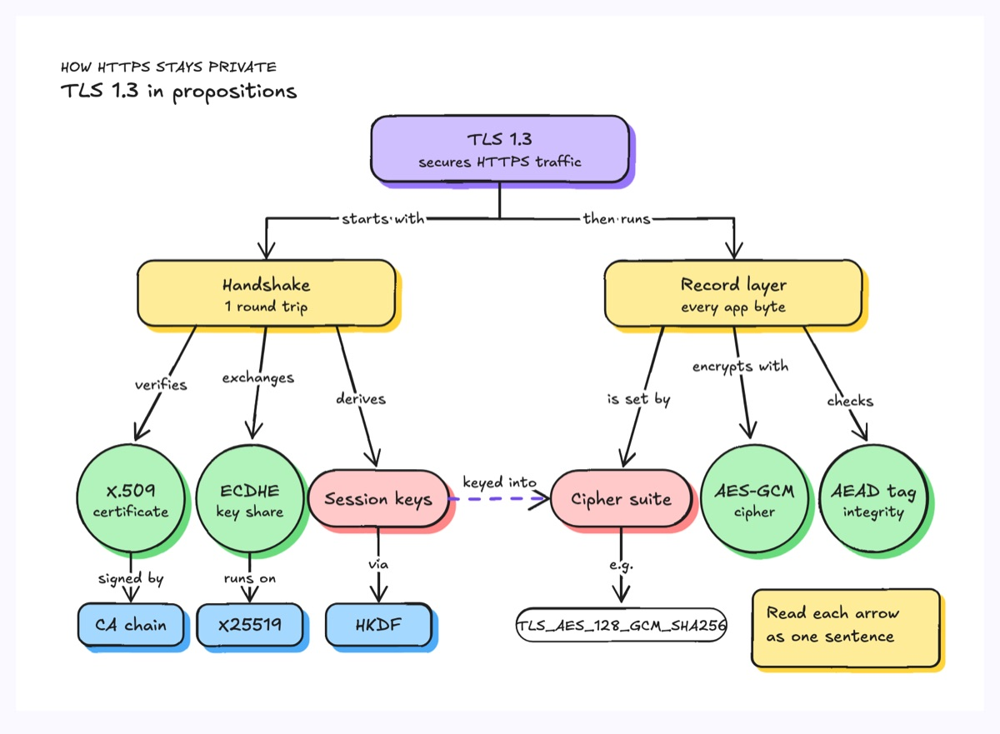
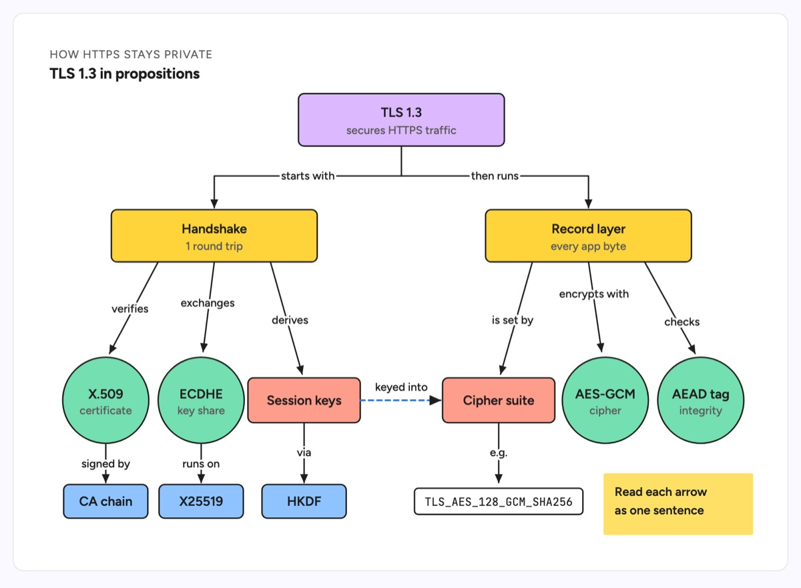

# Concept map

A concept map lays out concepts as nodes and joins them with labeled arrows, so each concept, link, concept triple reads as a sentence (a proposition). It grows top down from one root concept, with cross-links where branches meet. The example explains TLS 1.3: the handshake verifies an X.509 certificate, exchanges an ECDHE key share and derives session keys; the record layer encrypts with AES-GCM and checks an AEAD tag; a dashed cross-link shows the session keys being keyed into the cipher suite.

| Hand-drawn | Clean |
|---|---|
|  |  |

## Use it to explain

- How the parts of a protocol (TLS, OAuth, Raft) relate, before reading the spec.
- The vocabulary of a domain model for a new engineer, with the verbs that connect the terms.
- Where two subsystems meet, using cross-links between branches.

Not for: steps in time order or call sequences; use a sequence diagram or a flowchart.

## Anatomy

| Part | Class | Rule |
|---|---|---|
| Root concept | `d-box g0` | one, at the top centre |
| Main branch | `d-box g2` | elbow connectors from the root |
| Leaf concept | `d-box g1` circle | short name plus a `d-s` gloss |
| Shared concept | `d-box g3` pill | a node that both branches use |
| Detail | `d-box g4`, `d-tag` + `d-m` | a deeper example, such as a real cipher suite name |
| Link | `d-edge` + `d-lab` | every arrow carries a verb phrase |
| Cross-link | `d-edge dash acc` | joins two branches, labeled like any link |

## Tips

- Read every arrow aloud as a sentence; if it does not parse, change the verb.
- Keep link labels to one to three words and stagger their heights so they do not collide.
- Use colour by role (root, branch, leaf, shared), not by branch.

Reference: Figma template Concept map

Source: [example.svg](example.svg)
