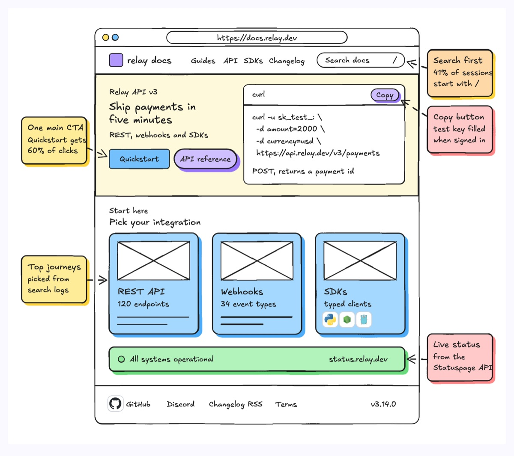
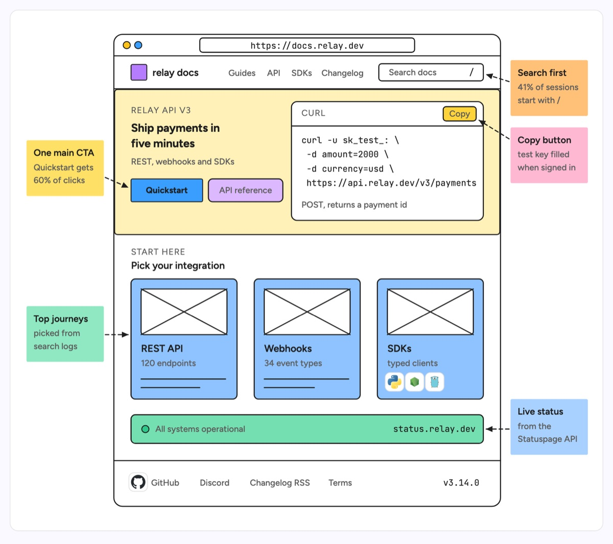

# Website wireframe

A low-fidelity page layout inside a browser frame: nav, hero with its main call to action, a row of cards with image placeholders, and the strips below, annotated with sticky notes that explain why each block is there. The example is the landing page of the Relay payments API docs: search in the nav, a hero with Quickstart and a copyable curl snippet, cards for REST API, Webhooks and SDKs, a live status strip and the footer, with notes tying each decision to data such as search logs and click share.

| Hand-drawn | Clean |
|---|---|
|  |  |

## Use it to explain

- The layout of a docs portal, admin console or dashboard page before anyone writes the components.
- Which data or API feeds each block (status strip from Statuspage, cards from search logs).
- The design decisions a page review should challenge, attached to the block they affect.

Not for: how pages link to each other (use `sitemap`) or how a user moves between screens (use `ux-workflow`).

## Anatomy

| Part | Class | Rule |
|---|---|---|
| Browser frame | `d-fillpaper`, `d-fill` dots, `d-tag` URL | One frame, real URL in `d-m` |
| Nav | `d-t`, `d-s`, `d-tag` | Logo block, 3 to 5 links, search field |
| Hero | `d-band g2` | Kicker, two-line headline, one primary `d-fill` button, one secondary |
| Code panel | `d-fillpaper` + `d-m` | Real snippet, Copy as `d-tag acc` |
| Card | `d-box g4` | Crossed `d-fillpaper` image placeholder, title, one-line fact, text lines |
| Status strip | `d-box g1` | Full content width, one line |
| Annotation | `d-note` + `d-edge dash` | Outside the frame, dashed arrow to the block it explains |

## Tips

- Keep placeholders crossed and text lines grey; only the headline, nav and labels get real copy.
- Put every annotation outside the frame so the layout stays readable.
- One primary button per view; a second filled button means the hierarchy is not decided.

Reference: Figma template Website wireframe (annotation style from the Excalidraw lo-fi wireframe)

Source: [example.svg](example.svg)
