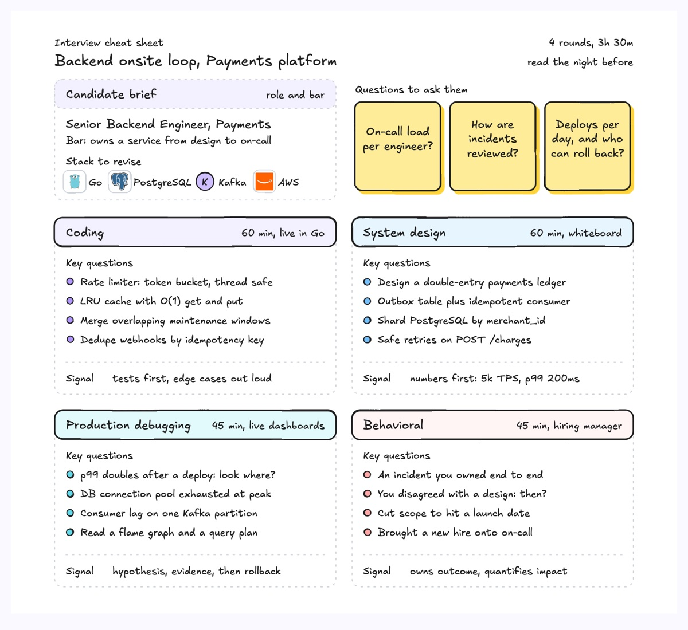
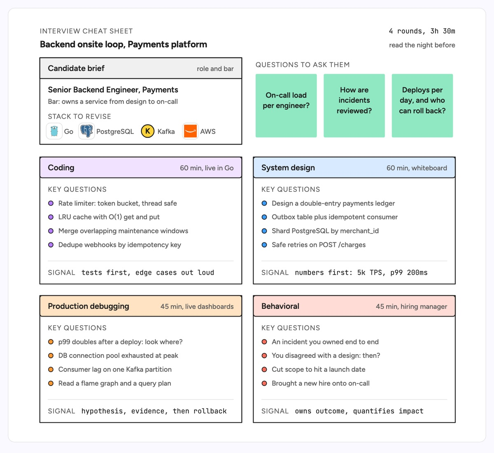

# Interview cheat sheet

A one-page brief card on top, then one card per interview round in a two-by-two grid, each with a colored header, the round's length and format, the key questions to prepare and the signal interviewers score. The example is a senior backend engineer onsite loop on a payments team: the role and bar, the Go, PostgreSQL, Kafka and AWS stack to revise, three questions to ask the panel, and rounds for coding, system design, production debugging and behavioral.

| Hand-drawn | Clean |
|---|---|
|  |  |

## Use it to explain

- What an engineering interview loop covers, round by round, for a candidate or a new interviewer.
- How a hiring team splits signal across rounds so two interviewers do not test the same thing.
- Prep for an on-call or architecture review: likely questions grouped by theme with the answer shape expected.

Not for: the hiring process over time with handoffs between recruiter, panel and committee (use `cross-functional-flowchart`).

## Anatomy

| Part | Class | Rule |
|---|---|---|
| Brief card | `d-lane` + `d-lanehead`, `d-t`, `d-s` | Role, bar and context, top left |
| Stack | `d-logo` + `d-s` | Real logos for what to revise |
| Questions to ask | `d-note g2` + `d-tn` | Three stickies, three lines each at most |
| Round card | `d-lane` + `d-band g0`..`g5` | One color per round, name left, length right |
| Key questions | `d-fill` dot + `d-s` | Four per card, one line each |
| Signal | `d-grid` rule, `d-k`, `d-m` | What a strong answer shows, one line |

## Tips

- Keep four questions per round; a fifth usually means the round should split.
- Write the signal as observable behavior ("numbers first"), not a trait ("smart").
- Use concrete numbers from the real system (TPS, p99) so design answers have a target.

Reference: Figma template Interview cheat sheet

Source: [example.svg](example.svg)
