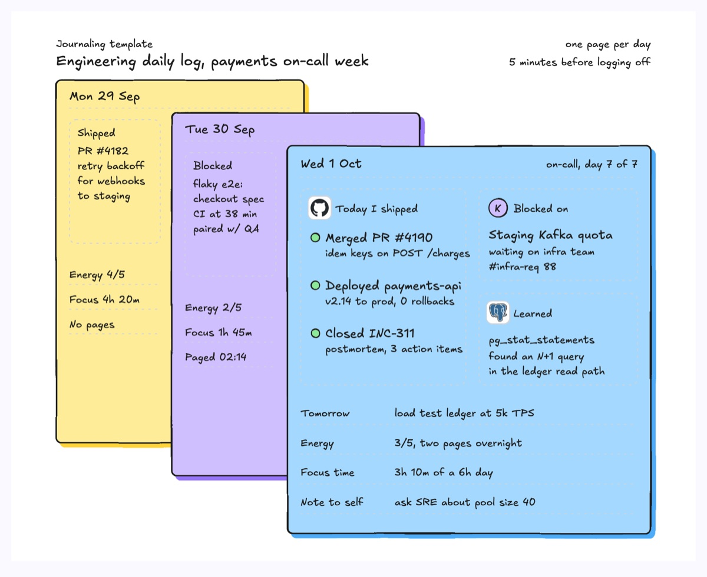
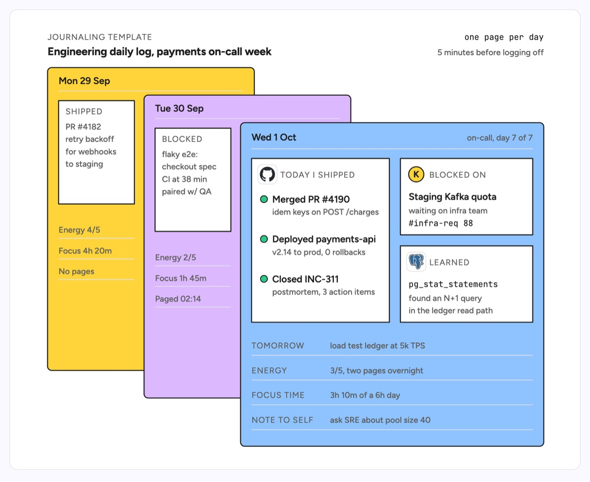

# Journaling template

A stack of dated pages, one per day, with the newest page in front. Each page has the same layout: a date line, one large block, two smaller blocks and a few ruled lines, so days compare at a glance. The example is an engineering daily log during a payments on-call week: Monday and Tuesday peek out behind Wednesday, which records what shipped (an idempotency PR, the payments-api v2.14 deploy, an incident postmortem), what is blocked (a staging Kafka quota), what was learned (an N+1 query found with pg_stat_statements) and lines for tomorrow, energy, focus time and a note to self.

| Hand-drawn | Clean |
|---|---|
|  |  |

## Use it to explain

- A daily engineering log format: shipped, blocked, learned, and the plan for tomorrow.
- How on-call load shows up across a week (energy, focus time, pages) next to delivery.
- The raw material for standups, weekly updates and promotion packets.

Not for: team-wide progress or dates (use `gantt-chart` or `horizontal-timeline`).

## Anatomy

| Part | Class | Rule |
|---|---|---|
| Page | `d-box g0`..`g5` | One color per day, each page offset down and right, newest in front |
| Date line | `d-t` + `d-grid` | Date left, context right |
| Main block | `d-lane` + `d-logo`, `d-k` | Shipped items, each a `d-fill` dot, `d-t` title and `d-s` detail |
| Side blocks | `d-lane` + `d-logo`, `d-k` | Blocked on and learned, one item each |
| Ruled lines | `d-k`, `d-s`, `d-grid` | Same four prompts every day |
| Back pages | same parts, shorter | Only the visible strip carries content |

## Tips

- Keep the same prompts every day so a week of pages can be compared.
- Link each item to its artifact (PR, ticket, incident) so the log can be searched later.
- Show at most three pages; older days belong in a weekly summary.

Reference: Figma template Journaling template

Source: [example.svg](example.svg)
