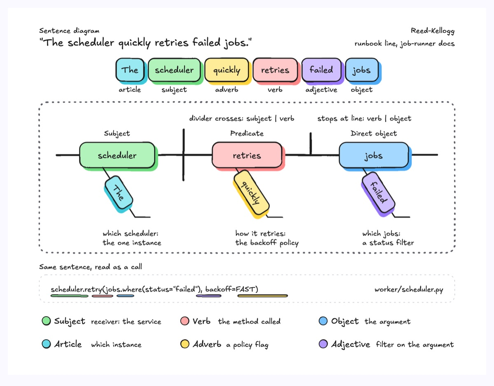
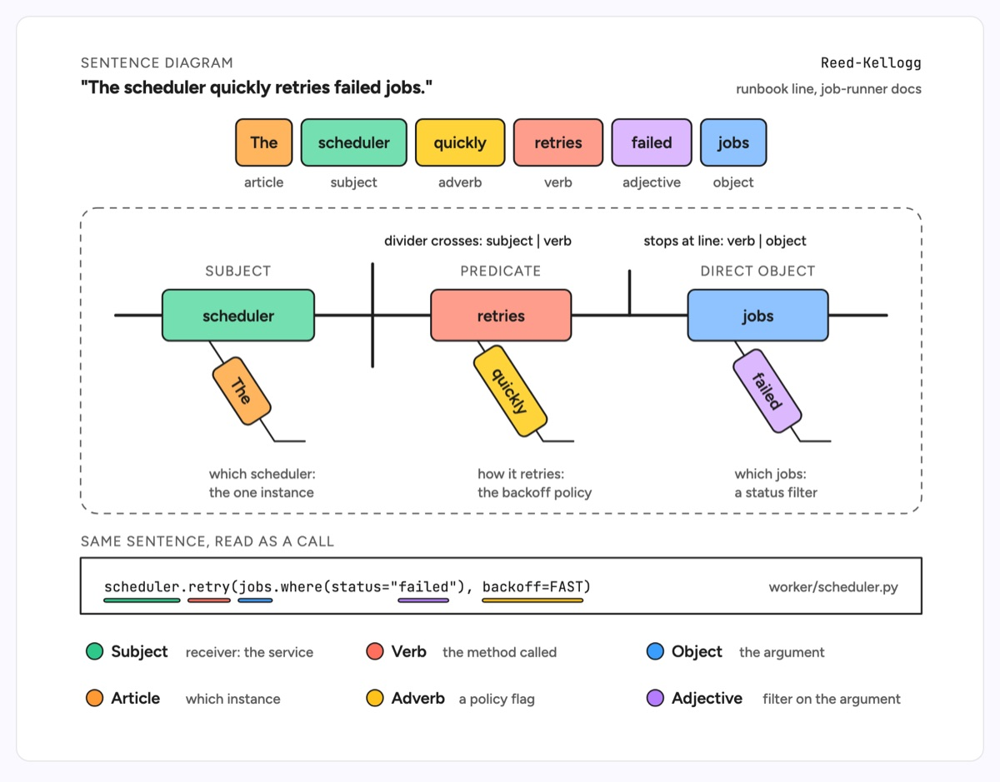

# Sentence diagram

A Reed-Kellogg diagram: the sentence's words on top, colored by part of speech, then a baseline that holds the subject, verb and direct object, with modifiers hanging on slanted lines below the word they describe. The example parses a line from job-runner docs, "The scheduler quickly retries failed jobs", and then reads the same sentence as a call, `scheduler.retry(jobs.where(status="failed"), backoff=FAST)`, so each grammatical role lines up with a part of the code.

| Hand-drawn | Clean |
|---|---|
|  |  |

## Use it to explain

- How an API name reads as a sentence: receiver as subject, method as verb, argument as object, flags as adverbs.
- Why a runbook or alert line is ambiguous: which noun a modifier belongs to ("failed jobs" against "retries quickly").
- Naming reviews: whether a method name, its filter and its policy flag say the same thing as the docs.

Not for: call order or data flow between services (use `sequence-diagram` or `flowchart`).

## Anatomy

| Part | Class | Rule |
|---|---|---|
| Word row | `d-box g0`..`g5` + `d-t`, `d-s` | One chip per word in reading order, part of speech underneath |
| Baseline | `d-edge thick` | One horizontal line carrying subject, verb and object |
| Subject divider | `d-edge thick` | Vertical line that crosses the baseline |
| Object divider | `d-edge thick` | Vertical line that stops at the baseline |
| Core words | `d-box g1`/`g3`/`g4` + `d-k` | Same color as the word chip, role kicker above |
| Modifier | `d-edge` slant + rotated `d-box` | Hangs under the word it modifies, same color as its chip |
| Code reading | `d-lane` + `d-m`, `d-fill` underlines | Underline each code token in its word's color |
| Legend | `d-fill` dot + `d-t`, `d-s` | Role and what it means in code |

## Tips

- Keep one color per part of speech across the chip row, the diagram and the code underlines.
- Put modifiers only under the word they modify; a slant under the wrong word is the bug the diagram exists to catch.
- Use a sentence of six to ten words; longer ones need a second diagram per clause.

Reference: Figma template Sentence diagram

Source: [example.svg](example.svg)
