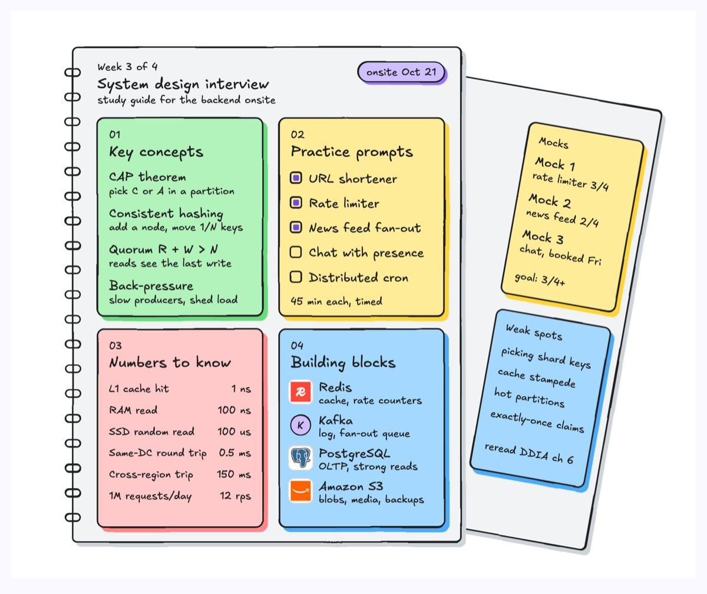
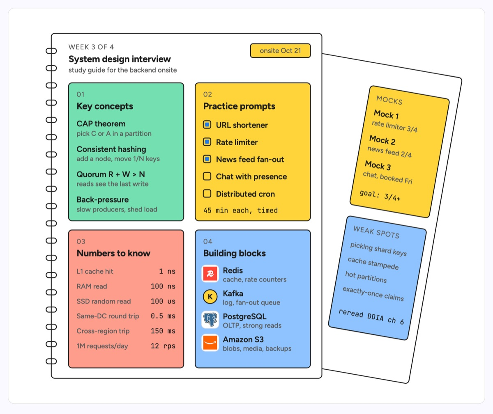

# Study guide

A spiral notebook page divided into a 2x2 grid of topic cards, with a second page tilted behind it for running notes. Each card collects one kind of material to revise. The example is prep for a backend system design interview loop: key concepts (CAP, consistent hashing, quorums, back-pressure), a practice prompt checklist, latency numbers to know, and building blocks with logos (Redis, Kafka, PostgreSQL, Amazon S3), with a mock interview log and weak spots on the back page.

| Hand-drawn | Clean |
|---|---|
|  |  |

## Use it to explain

- An onboarding plan for a new service owner: the concepts, the runbooks to practise, the numbers to know.
- Interview or certification prep for an engineering team (system design, Kubernetes, cloud exams).
- A revision sheet for an on-call rotation: alerts to recognise, SLO numbers, the tools in the path.

Not for: a schedule with dates and dependencies (use `gantt-chart` or `calendar-planner`).

## Anatomy

| Part | Class | Rule |
|---|---|---|
| Front page | `d-box` | Large plain page, spiral rings on the left edge |
| Spiral rings | `d-line` | Small rounded rects straddling the left edge, even spacing |
| Page header | `d-k`, `d-h`, `d-s`, `d-tag acc` | Week kicker, title, subtitle, the deadline in a pill |
| Topic card | `d-box g1`..`g4` | Four equal cards in a 2x2 grid, numbered `d-k`, title in `d-h` |
| Card content | `d-t` + `d-s`, `d-m`, checkbox `d-line` + `d-fillacc`, `d-logo` | Term and gloss, value columns right-aligned, ticked boxes for done items |
| Back page | `d-box` in a rotated `g` | Tilted about 10 degrees, only the right column of cards visible |

## Tips

- Give each card one type of content (terms, a checklist, a table, logos) so it reads at a glance.
- Right-align numbers in `d-m` so a latency table scans like a column.
- Keep the back page to two short cards; it is a hint of depth, not a second guide.

Reference: Figma template Study guide

Source: [example.svg](example.svg)
