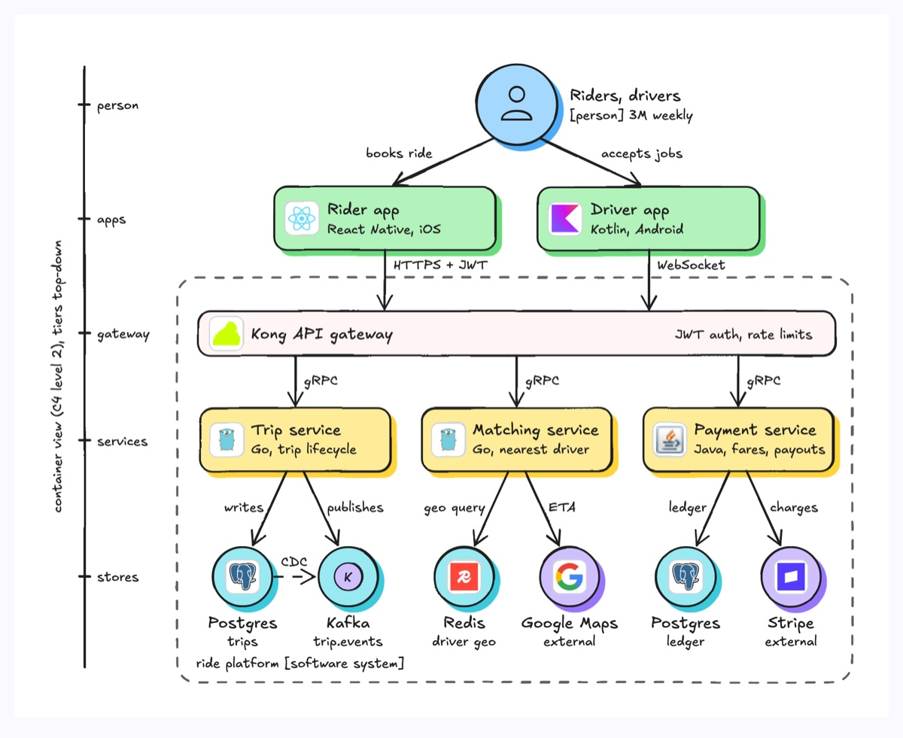
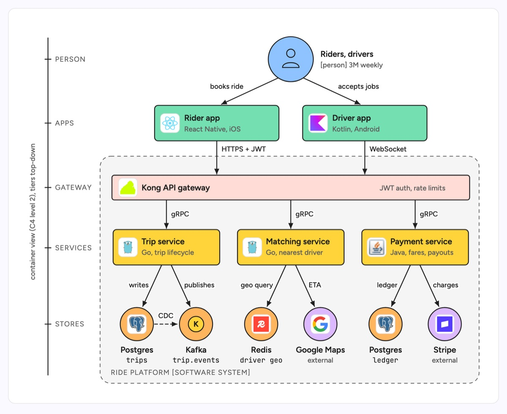

# C4 model (container)

A C4 container diagram zooms one level into a software system and shows the deployable pieces inside it: apps, services and data stores, with the technology of each and the protocol on every arrow. It reads top-down like a tree, from the people who use the system, through the apps and the gateway, to the services and the stores each one owns. The example is the backend of a ride-hailing product.

| Hand-drawn | Clean |
|---|---|
|  |  |

## Use it to explain

- Which services a product is made of, and which datastore each one owns.
- The protocols between tiers (HTTPS at the edge, gRPC inside, CDC into Kafka).
- Where the system boundary sits, and which dependencies are external (Stripe, Google Maps).

Not for: a request in time order (use `sequence-diagram`) or the system seen from outside (use `system-context`).

## Anatomy

| Part | Class | Rule |
|---|---|---|
| Tier rail | `d-edge`, `d-axis`, `d-k` | one tick per tier (person, apps, gateway, services, stores), labelled on the left. The tiers are not C4 levels: the whole drawing is the Container level, between Context above and Component below |
| Person | `circle.d-box g4` + person icon | at the top, label with role and scale |
| App containers | `d-box g1` + `d-logo` | title plus technology subtitle |
| Gateway | `d-band g3` | one wide stripe every client request crosses |
| Services | `d-box g2` + `d-logo` | one box per deployable, language and job in the subtitle |
| Stores | `circle.d-box g5` (owned), `g0` (external) | in pairs under the service that owns them |
| System boundary | `d-blob` + `d-k` | dashed, named "[software system]" |
| Arrows | `d-edge`, `d-edge dash`, `d-lab` | every arrow carries a protocol or verb |

## Tips

- Give every container its technology; a C4 box without one is just a name.
- Keep each store directly under the one service that writes it; shared databases are a smell worth showing on purpose.
- Colour external systems differently from owned ones so the boundary reads twice.
- Draw the system context first, then zoom into this view.

Reference: Figma template C4 model

Source: [example.svg](example.svg)
