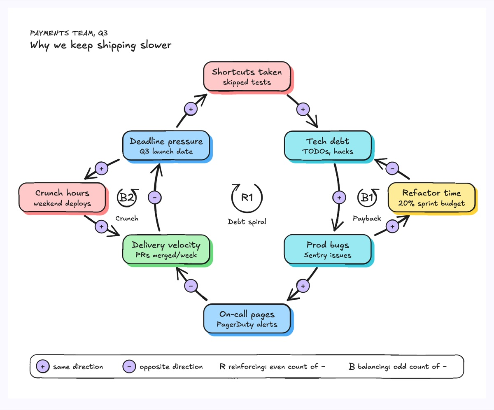
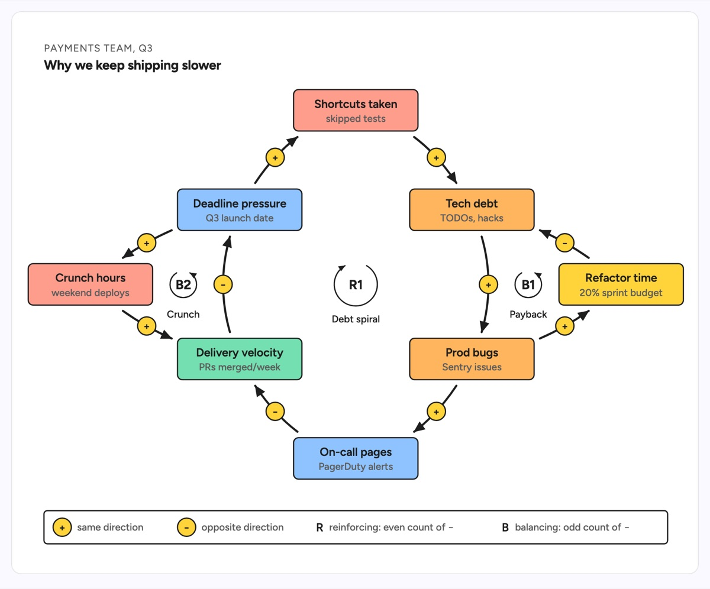

# Causal loop diagram

A causal loop diagram shows how variables in a system push on each other. Each arrow carries a polarity: `+` when the target moves in the same direction as the source, `−` when it moves the opposite way. Closed chains form loops, marked R (reinforcing, an even count of `−`) or B (balancing, an odd count). The example traces a tech debt spiral on a payments team: deadline pressure drives shortcuts, debt, prod bugs and on-call pages, which cut velocity and raise the pressure again, while refactor time and crunch hours act as brakes.

| Hand-drawn | Clean |
|---|---|
|  |  |

## Use it to explain

- Why a team keeps slowing down even though everyone is working harder (tech debt, on-call load, velocity).
- How a retry storm or autoscaling feedback amplifies an incident, and which control (backoff, rate limits) balances it.
- Why a fix like "add more crunch" helps briefly and then makes the reinforcing loop worse.

Not for: one-way process steps or request flows; use a flowchart or sequence diagram when nothing loops back.

## Anatomy

| Part | Class | Rule |
|---|---|---|
| Variable | `d-box g1`..`g5` + `d-t` / `d-s` | a noun that can go up or down, with a concrete measure underneath |
| Causal link | `d-edge thick` with marker | curved, following the loop; never two arrows into one arrowhead |
| Polarity | `d-badge` + `d-bt` | `+` or `−` on every link, placed mid-curve |
| Loop marker | `d-edge` arc + `d-h` | R or B, circling in the same direction as the loop |
| Loop name | `d-lab` | two words under the marker: "Debt spiral", "Payback" |
| Legend | `d-tag` + `d-s` | explains `+`, `−`, R and B once |

## Tips

- Name variables as quantities ("On-call pages"), not actions ("Page people"), so `+` and `−` read naturally.
- Count the `−` signs around each loop before labelling it R or B.
- Keep the main reinforcing loop as the central ring and hang balancing loops off its sides.
- Draw the loop marker arrow in the loop's real direction: clockwise for R1 here, counterclockwise for B1 and B2.

Reference: Figma template Causal loop diagram

Source: [example.svg](example.svg)
