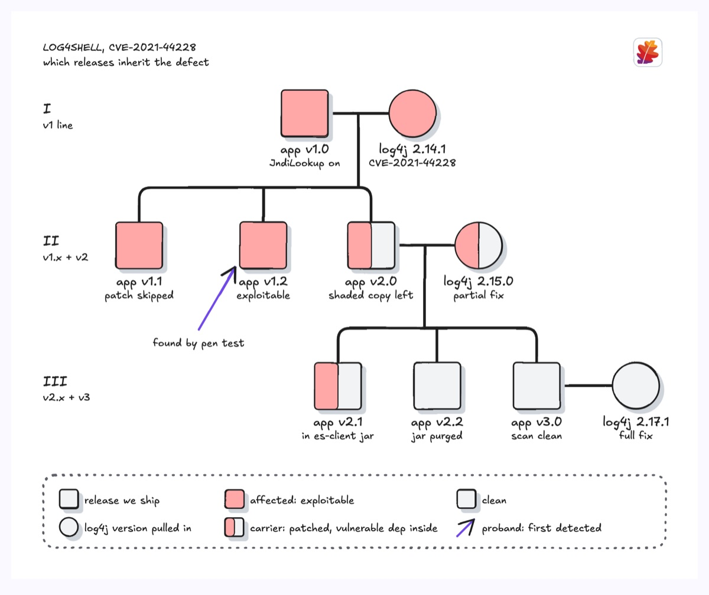
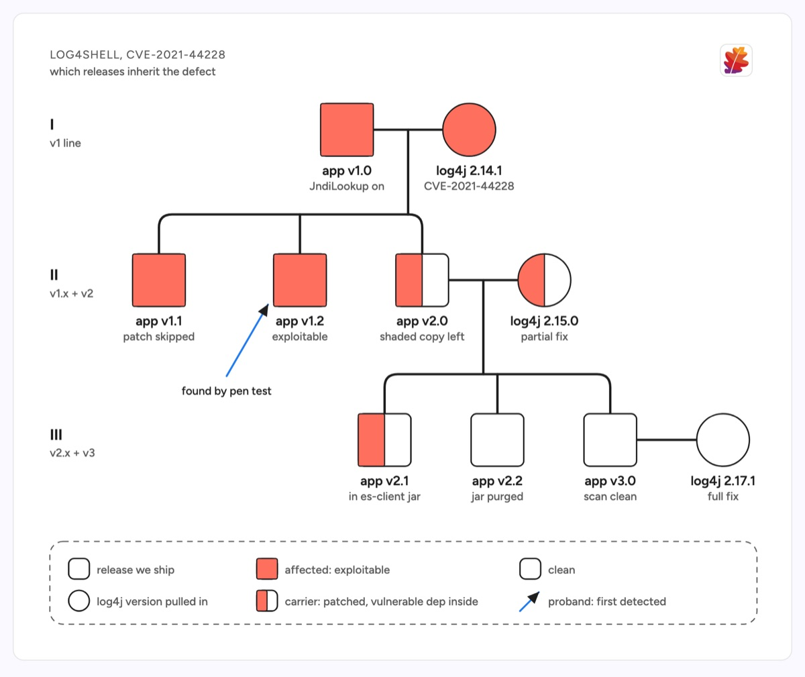

# Pedigree chart

A pedigree chart tracks how a trait passes down generations, using filled, half-filled and empty shapes for affected, carrier and clean. Here the trait is Log4Shell (CVE-2021-44228): each release we ship (square) is paired with the log4j version it pulled in (circle), and the shading shows which descendant releases are exploitable, which were patched but still carry a vulnerable shaded jar, and which are clean. Generation numerals on the left read as release lines v1, v2 and v3.

| Hand-drawn | Clean |
|---|---|
|  |  |

## Use it to explain

- Which supported release branches inherit a security defect, and which need a backport before an advisory goes out.
- Why a release that upgraded its direct dependency is still flagged: a transitive or shaded copy makes it a carrier.
- Where a defect was first detected (the proband) versus where it originated.

Not for: the timeline of the incident response (use a timeline) or the full dependency graph of one build (use a dependency graph).

## Anatomy

| Part | Class | Rule |
|---|---|---|
| Release | `d-box` rect | a square per shipped release, 56 units |
| Dependency version | `d-box` circle | the "mate" whose code the release takes in |
| Affected | `d-fill g3` | whole shape filled |
| Carrier | `d-fill g3` | left half filled only |
| Union and descent | `d-edge thick` | horizontal line between pair, drop from its midpoint to a sibship bar |
| Proband | `d-edge acc` + marker | one arrow, labelled with how it was found |
| Generation | `d-h` + `d-s` | roman numeral on the left, release line under it |
| Legend | `d-blob2` | explains shape and shading |

## Tips

- Keep one row per generation and align every shape in that row on the same centre line.
- Use only three states; a fourth shade turns the chart into a heatmap nobody can read.
- Put the CVE id and the dependency version in the subtitles so the chart doubles as a backport checklist.

Reference: Figma template Pedigree chart

Source: [example.svg](example.svg)
