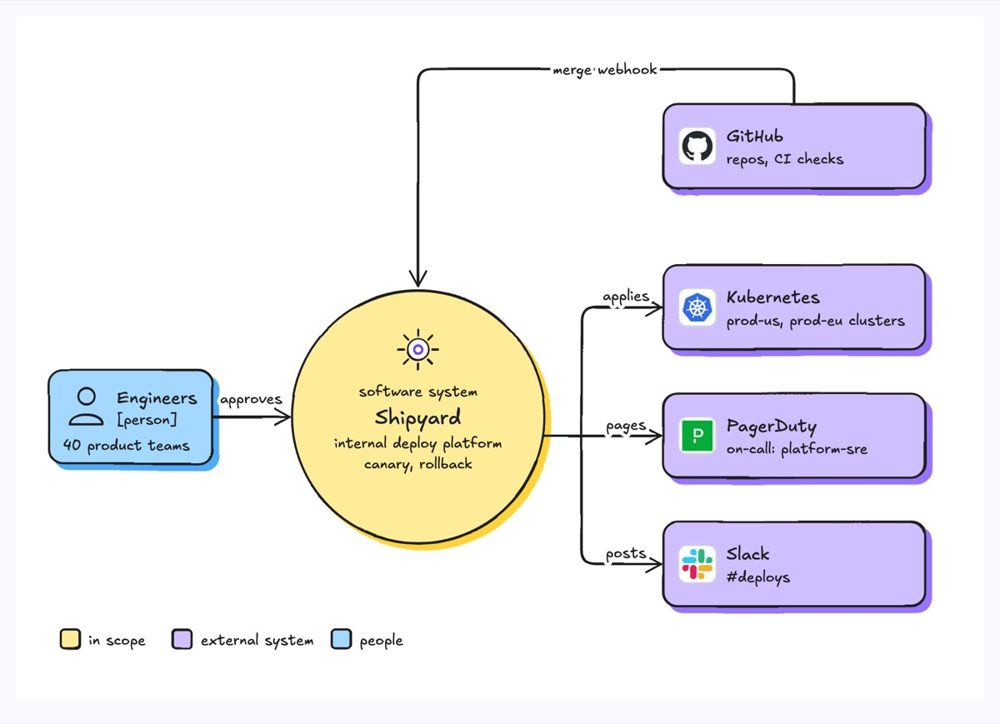
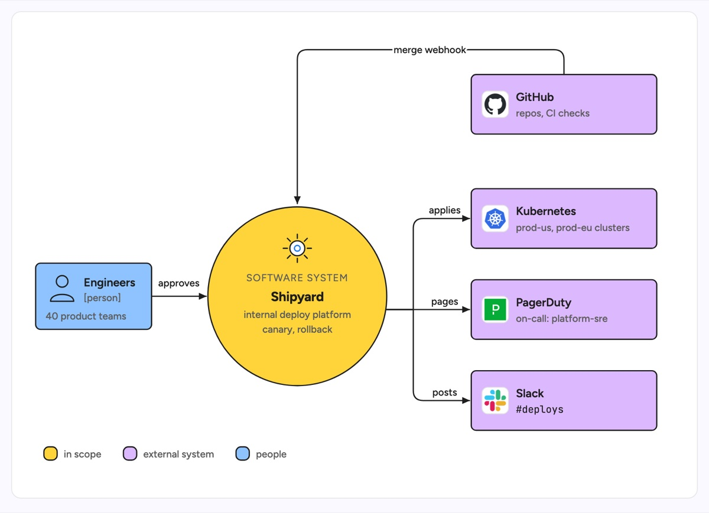

# System context diagram

A system context diagram puts one software system in the middle and shows only who and what it talks to: the people who use it and the external systems it depends on or drives. Internals are hidden on purpose. The example is Shipyard, an internal deploy platform that takes merge webhooks from GitHub, applies manifests to Kubernetes, pages PagerDuty when a rollout fails and posts status to Slack.

| Hand-drawn | Clean |
|---|---|
|  |  |

## Use it to explain

- The blast radius of a platform: every external system that breaks if it breaks.
- Which integrations push into the system (webhooks) and which it calls out to.
- The scope of a new service in a design review, before any internals exist.

Not for: the containers inside the system (use `c4-model`) or network placement (use `network-diagram`).

## Anatomy

| Part | Class | Rule |
|---|---|---|
| System in scope | `circle.d-box g2` + `d-h`, `d-k` | one large circle, the only thing in this colour |
| People | `d-box g4` + person icon | on the left, with role and head count |
| External systems | `d-box g0` + `d-logo` | stacked in one column on the right |
| Inbound loop | `d-edge` with rounded corners | goes over the top, back into the system |
| Outbound trunk | `d-edge` | one trunk that branches to each target |
| Arrow labels | `d-lab` | one verb each: applies, pages, posts |
| Legend | small `d-box` swatches + `d-s` | in scope, external, people |

## Tips

- Keep it to one system; if you need two circles you want a landscape diagram.
- Label arrows with what flows (webhook, page, message), not "uses".
- Route inbound and outbound arrows on opposite sides so direction reads at a glance.

Reference: Figma template System context diagram

Source: [example.svg](example.svg)
