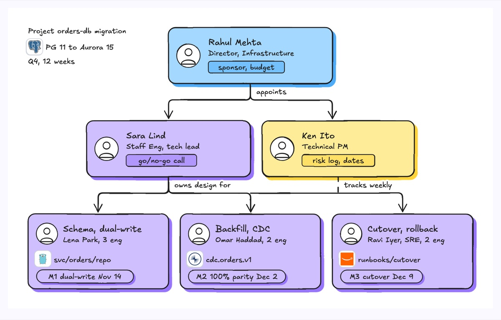
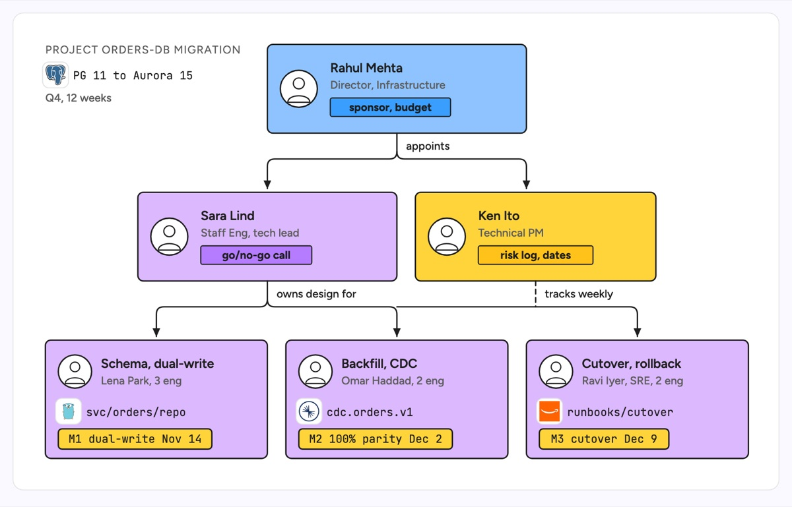

# Project organization chart

A small tree for a time-boxed project rather than the whole company: a sponsor at the top, the people who run the project in the middle, and the workstreams at the bottom with an owner and a milestone each. The example is a 12-week migration of the orders database from Postgres 11 to Aurora Postgres 15: a director as sponsor, a staff engineer as tech lead with the go/no-go call, a TPM tracking risk, and three workstreams (schema and dual-write, backfill and CDC, cutover and rollback).

| Hand-drawn | Clean |
|---|---|
|  |  |

## Use it to explain

- Who decides go/no-go on a risky migration and who only tracks status.
- Which engineer owns each workstream of a cross-team project, and its next milestone date.
- How a project team cuts across the line org for the length of a release or migration.

Not for: permanent reporting lines across the whole org (use `org-chart`).

## Anatomy

| Part | Class | Rule |
|---|---|---|
| Project header | `d-k`, `d-logo`, `d-m` | Top left: project name, the system it changes, duration |
| Sponsor | `d-box g4` + person icon | One wide card at the top with a role pill |
| Leads | `d-box g0`, `d-box g2` | Tech lead and TPM side by side, different colours for different authority |
| Delegation | `d-edge` with marker + `d-lab` | Rounded elbow arrows pointing down, labelled with a verb |
| Tracking | `d-edge dash` + `d-lab` | Dashed line for oversight without ownership |
| Workstream | `d-box g0` + `d-logo` + `d-tag acc` | Name, owner and size, the repo path or topic, and the milestone pill |

## Tips

- Give every workstream a dated milestone; a box without one is a team, not a workstream.
- Use a dashed line for people who track but do not own, so ownership stays unambiguous.
- Keep it to three levels; deeper detail belongs in a Gantt or RACI.

Reference: Figma template Project organization chart

Source: [example.svg](example.svg)
