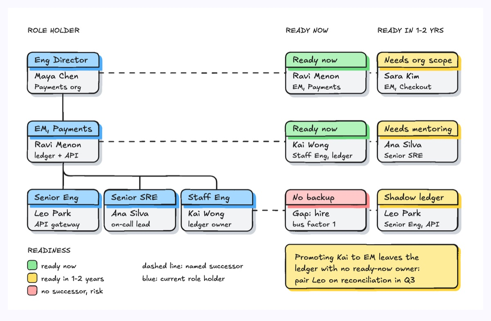
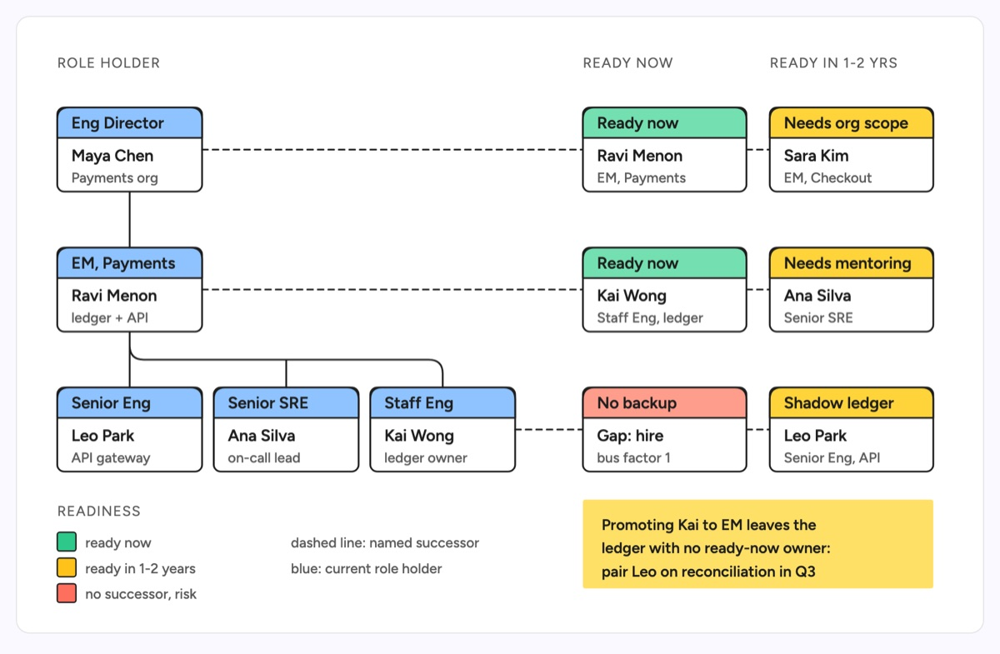

# Succession planning

A role tree on the left with named successors on the right: each critical role is joined by a dashed line to a ready-now and a ready-later successor, colored by readiness. It shows at once where a promotion cascades and where a role has no cover.

| Hand-drawn | Clean |
|---|---|
|  |  |

## Use it to explain

- Who can step in for an engineering director, an EM or a staff engineer if they leave or move up.
- How one promotion cascades: the EM moves up, the staff engineer becomes EM, and the ledger loses its owner.
- Which systems have a bus factor of one and need a shadow owner before the next reorg.

Not for: the full reporting structure of a department (use `org-chart`) or performance ratings (use `nine-box-talent-matrix`).

## Anatomy

| Part | Class | Rule |
|---|---|---|
| Column headings | `d-k` | role holder, ready now, ready later |
| Role holder card | `d-box` + `d-box g4` header path | role in the header, person and scope in the body |
| Reporting lines | `d-edge` | solid, vertical chain with rounded branches to siblings |
| Successor link | `d-edge dash` | dashed, one row per role, no arrowhead |
| Successor card | `d-box` + header `g1` / `g2` / `g3` | green ready now, yellow 1-2 years, red no successor; header names the next development step |
| Legend and risk note | `d-fill gN`, `d-s`, `d-note` + `d-tn` | legend for colors, one sticky note for the biggest risk |

## Tips

- Name the gap: a red "no backup" card is the most useful thing on the page.
- Reuse the same person in two places when a promotion cascades; that is the story.
- Put the development action in the successor header, not just a readiness label.

Reference: Figma template Succession planning

Source: [example.svg](example.svg)
