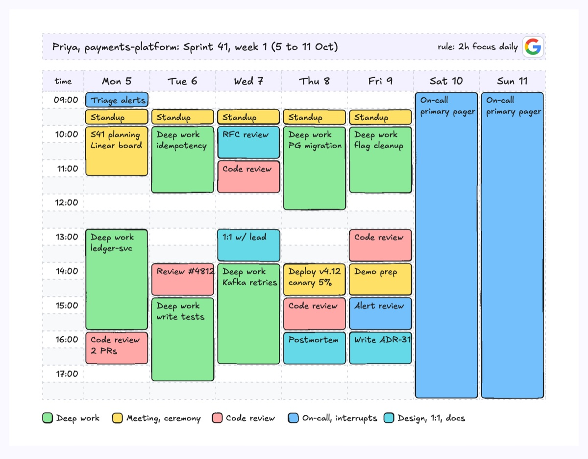
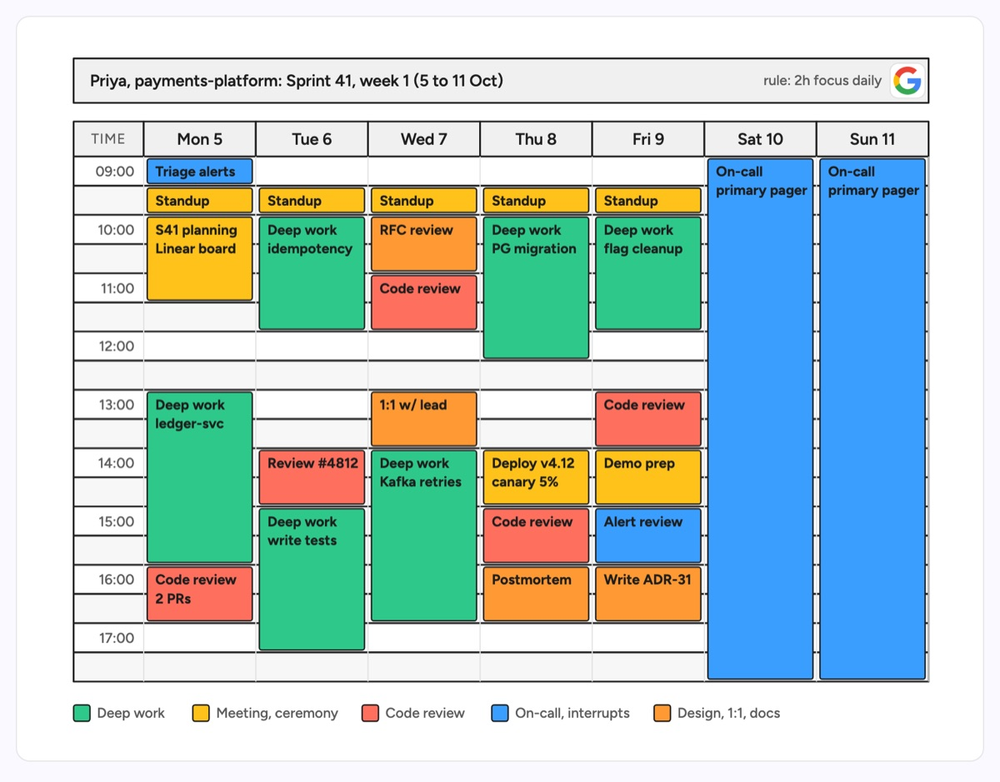

# Time blocking calendar

A full-width title bar over a grid of day columns and half-hour rows with alternating stripes, where each commitment is a coloured block whose height is its duration. Gaps stay visible as free time. The example is one week for a backend engineer on a payments-platform team: a daily standup, protected deep-work blocks on the ledger service, code review slots, a design review and postmortem, a v4.12 deploy window, and the on-call primary shift covering the weekend.

| Hand-drawn | Clean |
|---|---|
|  |  |

## Use it to explain

- How an engineer protects focus time around standups, reviews and interrupts.
- What an on-call week costs in calendar time, including the weekend shift.
- Why a deploy window or postmortem should not sit inside someone's longest deep-work block.

Not for: a month-level view of releases and sprints (use `calendar-planner`).

## Anatomy

| Part | Class | Rule |
|---|---|---|
| Title bar | `d-lanehead` + `d-t`, `d-s` + `d-logo` | Who, team, sprint and week; the scheduling rule and the calendar source on the right |
| Time column | `d-lanehead` + `d-s` | One label per hour, right aligned |
| Day header | `d-lanehead` + `d-t` | Day and date, centred |
| Row stripe | `d-lane`, `d-lane alt` | One stripe per half hour, alternating |
| Column divider | `d-grid` | Vertical lines between days |
| Block | `d-fill g1`..`g5` + `d-tw` | Height is duration, inset 3px from the column; title, then what it is for |
| Legend | `d-fill` swatch + `d-s` | Under the grid, one entry per block colour |

## Tips

- Name what a deep-work block is for (idempotency, PG migration), not just "focus".
- Leave lunch and slack time empty; the gaps are part of the message.
- Keep labels to about 12 characters; a half-hour block fits one line only.

Reference: Figma template Time blocking calendar

Source: [example.svg](example.svg)
