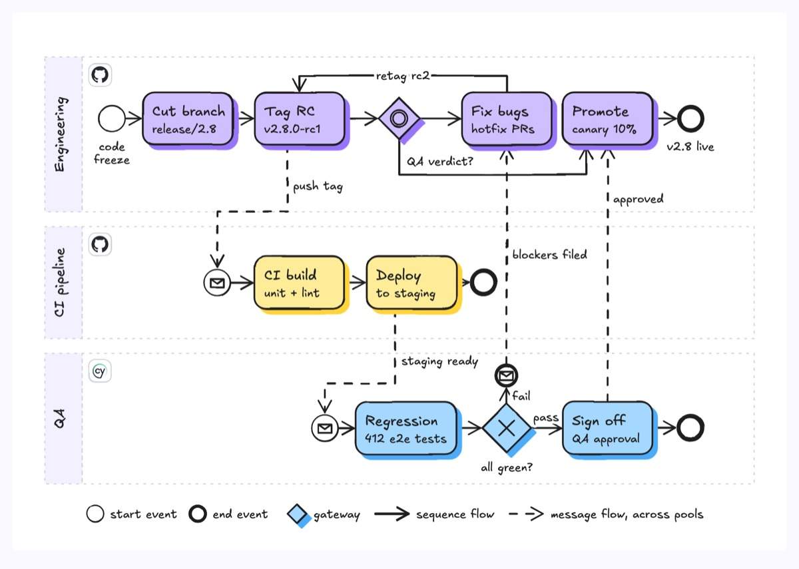
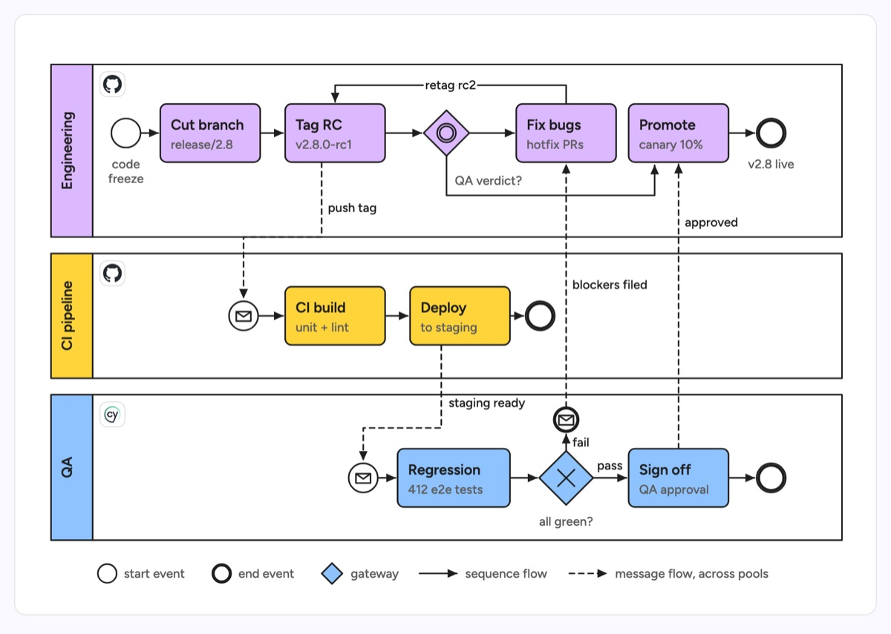

# BPMN diagram

Business Process Model and Notation: pools for each participant, rounded tasks, circle events and diamond gateways, with solid sequence flows inside a pool and dashed message flows between pools. The example is a v2.8 release: Engineering cuts and tags a release candidate, the CI pipeline builds and deploys it to staging, and QA runs regression and either signs off (a 10% canary in production) or ends in a message event that files blockers back to Engineering (fix and retag rc2).

| Hand-drawn | Clean |
|---|---|
|  |  |

## Use it to explain

- A release train with gates between engineering, CI and QA.
- A change-management or deploy approval process with explicit decision points.
- A data pipeline run where systems signal each other through events.

Not for: informal sketches of a simple flow (use a flowchart) or call timing between services (use a sequence diagram).

## Anatomy

| Part | Class | Rule |
|---|---|---|
| Pool header | `d-lanehead g<n>` | Narrow, with the pool name rotated in `d-t` |
| Pool body | `d-lane` | One per participant or system, gap between pools |
| Task | `d-box g<n>` | Verb title in `d-t`, specifics in `d-s` |
| Start event | `d-fillpaper` circle | Thin ring, trigger named underneath |
| End event | `d-fillpaper` + `d-edge thick` | Thick ring, outcome named underneath |
| Message end event | `d-fillpaper` + `d-edge thick` + `d-line` envelope | Sends the message that crosses to another pool |
| Message start event | `d-fillpaper` + `d-line` envelope | Thin ring: a pool that starts when another pool's message arrives |
| Event-based gateway | `d-box` diamond + two `d-line` rings | Waits for whichever message comes first; each outgoing path starts at a task that receives one |
| Exclusive gateway | `polygon.d-box` + `d-line` X | Question below, label each outgoing flow |
| Sequence flow | `d-edge` | Solid, only within one pool |
| Message flow | `d-edge dash` | Dashed, only between pools |

## Tips

- Never draw a solid sequence flow across a pool boundary; that is what message flows are for.
- Put the system or tool logo in the pool corner, not in every task.
- Show the loop back (retag rc2) explicitly; it is usually where releases slip.
- Include a legend; most readers do not know BPMN symbols by heart.

Reference: Figma template BPMN diagram

Source: [example.svg](example.svg)
