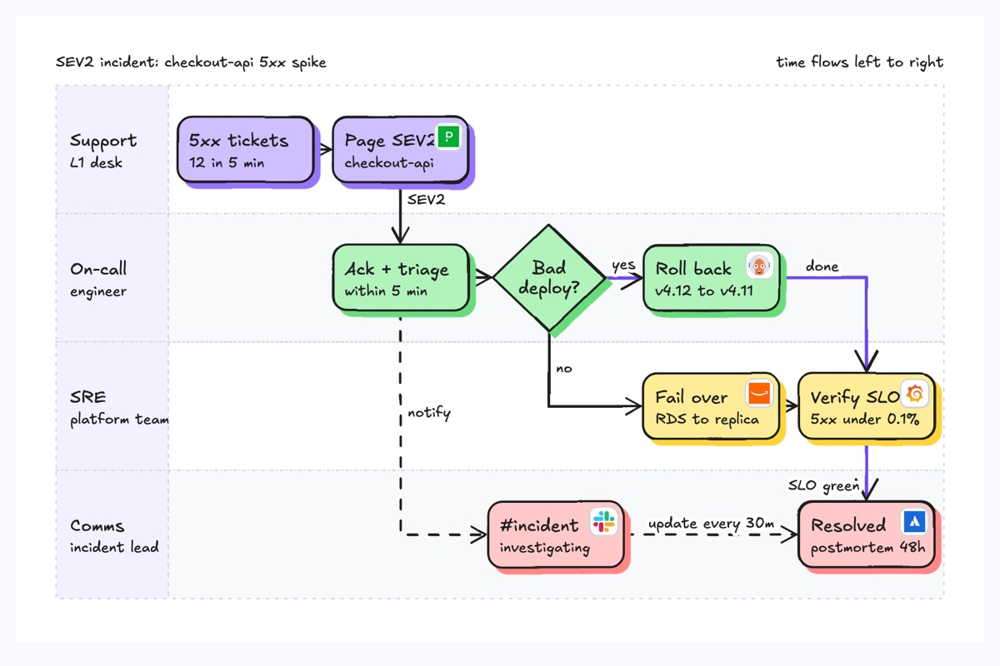
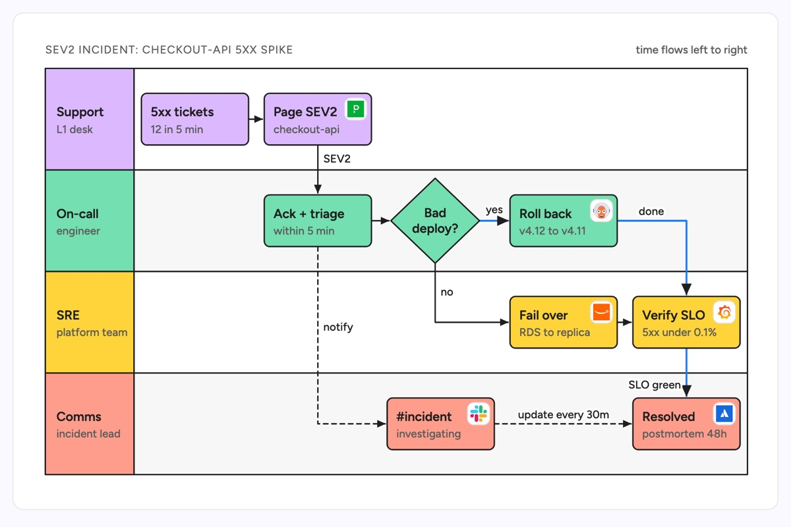

# Cross-functional flowchart (swimlane)

A flowchart split into horizontal lanes, one per team or role, so every step sits in the lane of whoever owns it and every arrow that crosses a lane line is a handoff. The example follows a SEV2 checkout-api incident from a spike in support tickets, through the on-call engineer's rollback-or-failover decision and SRE's SLO check, to Comms posting the resolution.

| Hand-drawn | Clean |
|---|---|
|  |  |

## Use it to explain

- An incident runbook: who pages whom, who decides, who tells customers.
- A release or change process where code moves between dev, review, QA and ops.
- An on-boarding or access request that hops between engineering, security and IT.

Not for: a single-actor algorithm (use a flowchart) or message timing between services (use a sequence diagram).

## Anatomy

| Part | Class | Rule |
|---|---|---|
| Lane body | `d-lane`, `d-lane alt` | One per team, alternate fills, equal heights |
| Lane header | `d-lanehead g0`..`g3` | Team name in `d-t`, role in `d-s`; colour matches its steps |
| Step | `d-box g<n>` | Same `g` as its lane; title `d-t`, detail `d-s` |
| Decision | `polygon.d-box` | Diamond with a short question, split over two lines if needed; label each exit (yes / no) |
| Handoff | `d-edge` | Crosses a lane line; label it with what is handed over |
| Happy path | `d-edge acc` | Highlights the path to resolution |
| Async update | `d-edge dash` | Notifications that do not block the flow |
| Tool | `d-logo` | Logo slot for the product used at that step |

## Tips

- Order lanes by who acts first, top to bottom; time runs left to right.
- Keep steps on a shared column grid so handoffs are straight vertical lines.
- Every crossing of a lane line is a handoff; if there are many, the process has too many owners.
- Use dashed edges for "keep informed" links so they do not read as blocking steps.

Reference: Figma template Cross-functional flowchart (swimlane)

Source: [example.svg](example.svg)
