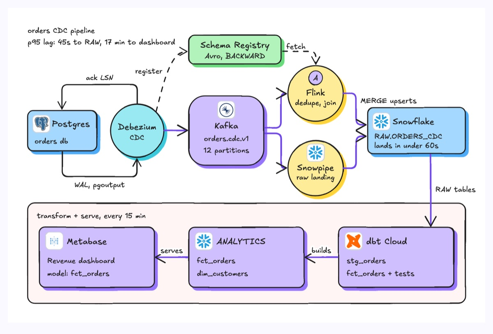
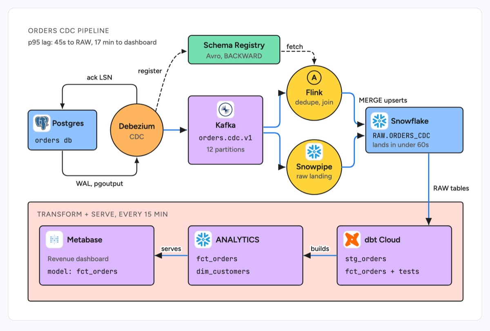

# Data pipeline

Stages from source to consumer, drawn as rectangles for stores, circles for processing steps and a rounded hub for the log or bus in the middle, with fan-out and fan-in where work splits and rejoins. The example is an orders CDC pipeline: Postgres changes captured by Debezium (with the WAL and ack-LSN loop), published to Kafka, processed by Flink and landed raw by Snowpipe Streaming into Snowflake, then modelled by dbt and served in Metabase, with a schema registry on the side.

| Hand-drawn | Clean |
|---|---|
|  |  |

## Use it to explain

- How data gets from an OLTP database to a dashboard, and the latency of each hop (here 45s to RAW, 17 min to the dashboard).
- Where streaming ends and batch begins (here, Snowflake RAW to dbt every 15 minutes).
- Which components share a contract, such as Avro schemas in a registry.

Not for: request and response traffic between services (use `sequence-diagram` or `layered-architecture`).

## Anatomy

| Part | Class | Rule |
|---|---|---|
| Store | `d-box` rect + `d-logo` | Source and sink tables, with the real table or db name in `d-m` |
| Processor | `d-box` circle + `d-logo` | One verb-ish role in `d-s` (dedupe, join, raw landing) |
| Hub | `d-box g0`, `rx` 28 | The log or bus, with topic name and partitions |
| Data flow | `d-edge acc` | Main path; fan-out and fan-in with rounded right angles, separate arrowheads |
| Control flow | `d-edge` + `d-lab` | Loops such as acks and WAL reads, labelled |
| Side service | `d-box g1` + `d-edge dash` | Registry, catalog or config, dashed because it is not the data path |
| Batch stage | `d-band` + `d-box g0` | A band for the scheduled part, flowing back right to left in a U |

## Tips

- Put a latency or freshness figure on the drawing; it is usually the first question.
- Keep the stream path on one row and drop the batch or serving part into a band below.
- Offset fan-in arrows so each one keeps its own arrowhead.

Reference: Figma template Data pipeline

Source: [example.svg](example.svg)
