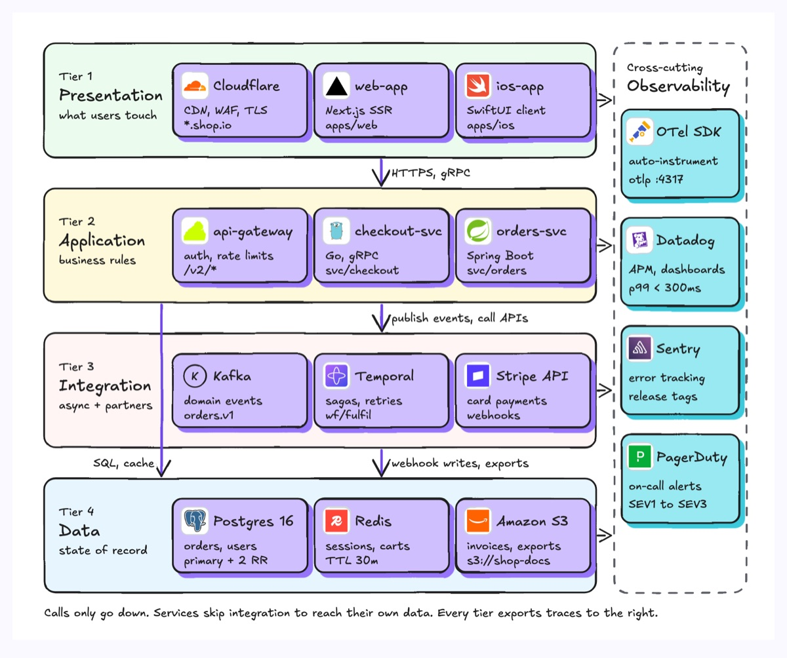
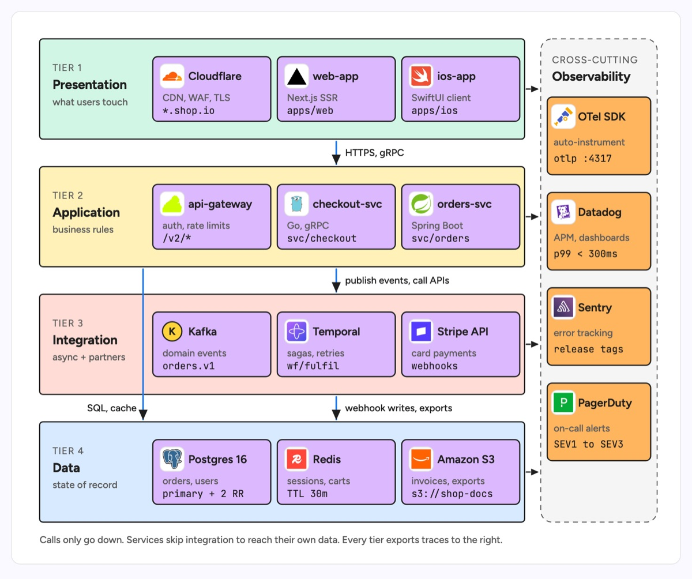

# Layered architecture

Horizontal tiers stacked top to bottom, each holding the components that run at that level, with arrows showing that calls only go down. A tier may skip the one below it when that is the real path, as services do here to reach their own database. A cross-cutting column on the side holds the concerns every tier shares, such as observability or auth. The example is a shop platform: presentation (Cloudflare, Next.js, iOS), application (Kong, Go and Spring services), integration (Kafka, Temporal, Stripe) and data (Postgres, Redis, S3), with OpenTelemetry, Datadog, Sentry and PagerDuty on the right.

| Hand-drawn | Clean |
|---|---|
|  |  |

## Use it to explain

- What runs where in a service platform, and which tier owns which product.
- The dependency rule a codebase enforces (UI never talks to the database directly).
- Where a cross-cutting concern such as tracing or auth hooks into every tier.

Not for: one request moving through the system over time (use `sequence-diagram` or `request-lifecycle`).

## Anatomy

| Part | Class | Rule |
|---|---|---|
| Tier | `d-band g1`..`g4` | One band per tier, full width, same height, top tier is closest to the user |
| Tier header | `d-k`, `d-h`, `d-s` | Kicker "Tier N", tier name, one-line purpose, on the left of the band |
| Component | `d-box g0` + `d-logo` | Logo slot, name in `d-t`, role in `d-s`, path or setting in `d-m` |
| Call between tiers | `d-edge acc` + `d-lab` | Downward arrows only, labelled with the protocol or verb; draw a skip past a tier as its own arrow |
| Cross-cutting column | `d-blob` + `d-box g5` | Dashed group on the right, spanning all tiers |
| Telemetry tick | `d-edge dash` | Short dashed arrow from each band into the column |

## Tips

- Keep three or four components per tier; more than that means the tier wants a `tech-stack-mapping` instead.
- Put the rule ("calls only go down") under the drawing so a reader knows what an upward arrow would mean.
- Give each tier a different `g` colour but keep the boxes inside it one colour, so tiers read as rows.

Reference: Figma template Layered architecture (structure from the Excalidraw layered pattern)

Source: [example.svg](example.svg)
